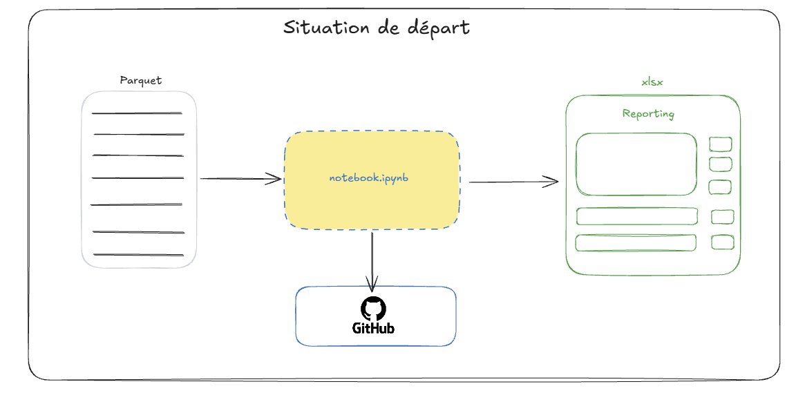

Faisons le point sur la situation actuelle en nous basant sur le repo [MEDAS-TP-Financial-Reporting](https://github.com/surybang/MEDAS-TP-Financial-Reporting). Vous avez normalement dans un premier temps rempli le notebook pour générer le reporting demandé. La situation ci-dessous devrait vous sembler familière : c'est ce que vous avez fait.

Cette situation constitue une première étape et non une fin en soi. Notre *notebook* est certes versionné mais il n'est peut-être pas propre : il est constitué d'étapes potentiellement inutiles à la génération du rapport, tout est *hardcodé* et non modulable. Si on doit le faire évoluer c'est potentiellement compliqué de ne pas tout casser.

Vous noterez cependant que le fichier `Parquet` n'est pas stocké localement : il est hébergé sur un espace `MinIO` distant. C'est une bonne pratique anticipée dans le TD car dans un environnement cloud native, le stockage local est éphémère : les environnements sont faits pour être détruits et reconstruits.

Vous aurez également remarqué que la génération du rapport est un processus entièrement manuel : vous devez ouvrir le notebook, relancer les cellules dans le bon ordre et vous assurer qu'aucune modification en cours de route n'a introduit d'effet de bord. Ce n'est pas scalable et c'est source d'erreur. C'est précisément ce que nous ne voulons plus faire.

::: {.callout-note}
## Pourquoi `.parquet` et non `.csv` ?

Le fichier de données utilisé dans ce projet est au format `.parquet`. Ce n'est pas un choix anodin.

Le format `.csv` est du texte brut : chaque valeur est stockée comme une chaîne de caractères, les types sont réinterprétés à chaque lecture et l'intégralité du fichier doit être chargée en mémoire même si vous n'avez besoin que de quelques colonnes.

`.parquet` est un format **colonnaire binaire** : les types sont stockés explicitement (une date reste une date, un entier reste un entier), la compression est bien plus efficace et la lecture est sélective. Si votre code n'utilise que 3 colonnes sur 50, seules ces 3 colonnes sont chargées.

Il embarque également le **schéma** complet du fichier dans ses métadonnées (nom des colonnes, types, nullabilité). Cela permet de lire le schéma sans lire les données et donc de détecter du **schema drift** : si un fichier entrant a une colonne qui a changé de type ou disparu, vous pouvez l'identifier immédiatement avant même de charger les données. Avec un `.csv` cette détection nécessite de lire et d'inférer les types ligne par ligne ce qui est moins fiable et plus coûteux.

C'est le format standard de facto de l'écosystème data moderne : `pandas`, `Polars`, `DuckDB` et `Spark` le lisent tous nativement. Il se prête particulièrement bien au stockage dans un *object store* ce qui en fait un choix naturel dans notre architecture.
:::