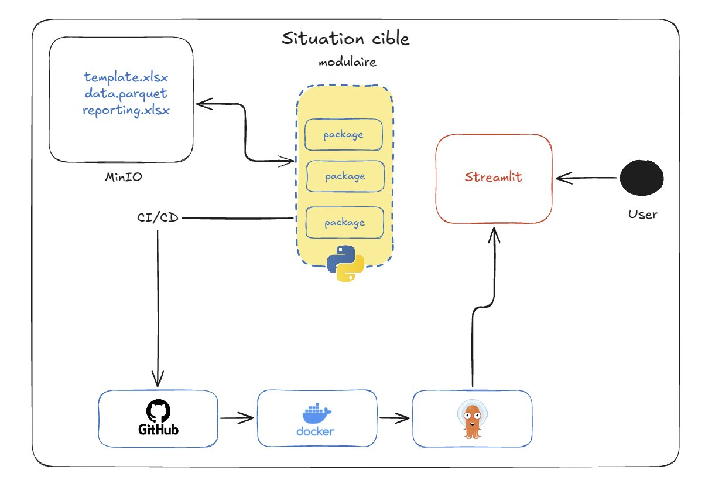

Voici notre cible (voir le schéma plus bas ⬇), nous souhaitons créer un projet `Python` composé de plusieurs *packages* avec une responsabilité propre afin d’exposer notre *reporting* au travers d’une interface utilisateur `Streamlit`. La chaine CI/CD sera expliquée plus tard dans l’article, pour l’heure contentez vous de garder en tête ce schéma pour savoir où on va.

**Pourquoi des packages ?**

Comme nous venons de le voir, le notebook de la situation de départ mélange exploration, transformation et génération du rapport dans un seul fichier. La situation cible découpe le projet en `packages Python`, chacun avec une responsabilité unique et claire. Un *package* gère la lecture des données depuis `MinIO`, un autre la génération du fichier `Excel` et encore un autre pour l'interface `Streamlit`. Ce principe s'appelle la **séparation des responsabilités (SRP)** : chaque module fait une chose et une seule. Cela rend le code testable et réutilisable. Nous mettrons en place des tests avec `pytest` pour nous assurer que chaque *package* se comporte comme attendu.

**Le rôle de MinIO évolue**

Dans la situation de départ, `MinIO` hébergeait uniquement la donnée source. Dans la situation cible, il devient le *storage* central du projet : il contient le fichier de données `data.parquet`, le template Excel `template.xlsx` et le rapport généré `reporting.xlsx`. Tout ce qui entre et tout ce qui sort du pipeline transite par `MinIO`. C'est votre source de vérité.



Avant de passer à l’étape suivante, assurez-vous que ces points sont remplis de votre côté :

- Vous avez récupéré les données et vous les avez stockées sur votre espace MinIO
- Vous avez un nouveau repo sur GitHub pour suivre le projet en même temps
    - Je vous conseille de réutiliser ce [template](https://github.com/surybang/MEDAS-TP-Financial-Reporting).

**Comment récupérer les données ?**

Récupérer les données via [cette URL](https://minio.lab.sspcloud.fr/fabienhos/MEDAS-FinancialReporting/data/financial_data.parquet) et stockez-les dans [votre stockage de données](https://datalab.sspcloud.fr/s3/?profile=default).

Dans ce dernier, faites un nouveau dossier avec la structure suivante pour faciliter l’exécution des commandes qui viendront tout au long de l’article :

```markdown
MEDAS-FinancialReporting/
├── template/
│   └── template_a_remplir.xlsx # Le template à remplir
├── data/
│   ├── raw/
│   │   └── financial_data.parquet # Vos données brutes ici
│   └── processed/
└── output/
```

Quelques mots sur la structure, pourquoi avoir des sous-dossiers `raw` et `processed` dans `data` ? Nous savons déjà que nous allons appliquer des transformations à nos données, dans une optique de reproductibilité nous voulons garder des données stockées en fonction de leur niveau de transformation. C'est pourquoi nous allons stocker les données brutes dans `raw` et les données transformées dans `processed`. Les données dans `raw` ne sont jamais modifiées : elles constituent votre **source de vérité**, celle à partir de laquelle tout peut être recalculé et rejoué. (C’est important de s’en souvenir et surtout de l’appliquer 📖🖋).

::: {.callout-note}
## Pourquoi ne pas stocker les données dans VS Code ?

Comme évoqué dans la partie précédente, dans un environnement cloud native le stockage local est éphémère : les environnements sont faits pour être détruits et reconstruits. Stocker vos données localement c'est donc prendre le risque de tout perdre d'un coup.

L'autre raison est architecturale. Un environnement cloud native repose sur un principe fondamental : **la séparation du calcul et du stockage**. `VS Code` est un environnement de développement, `MinIO` est un outil de stockage. Et non, `GitHub` n'est pas une solution de stockage de données : il est fait pour versionner du code source et non des fichiers volumineux comme un `.parquet`. C'est `MinIO` qui joue ce rôle ici.
:::