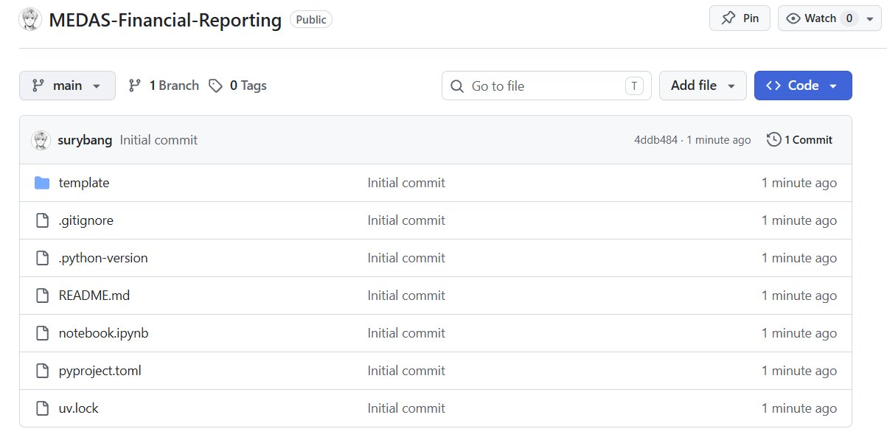
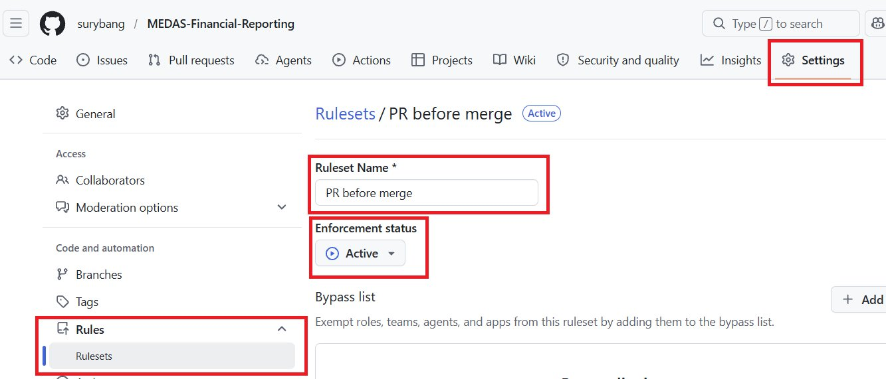
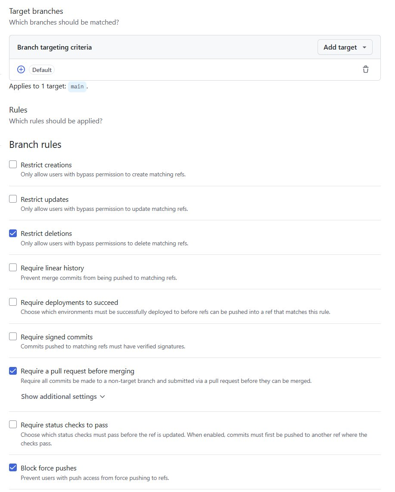
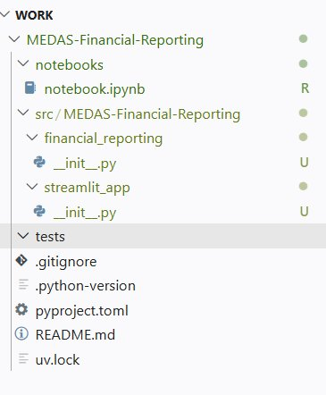
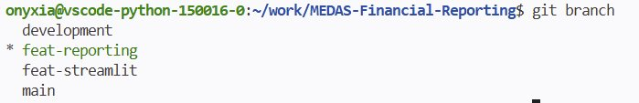
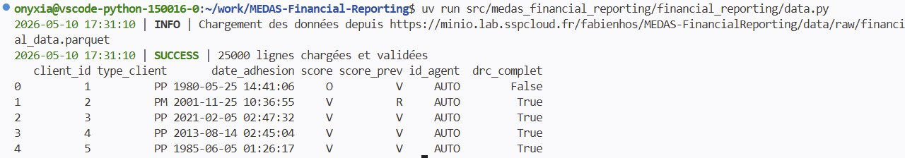
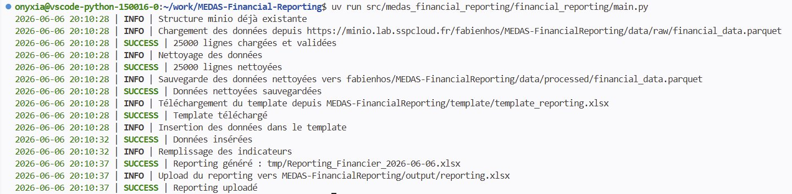
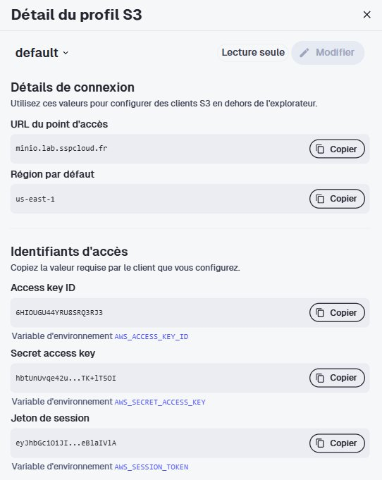

Pour rappel, je vous conseille vivement de repartir du template proposé plus tôt, ainsi votre repo actuel devrait ressembler à ceci :

::: {style="text-align: center;"}

:::

Dans un premier temps, je dois avouer avoir menti : avant de coder, nous allons configurer notre repo GitHub en protégeant notre branche `main`.

Dans les paramètres du repo, dépliez le menu **Rules** et créez une nouvelle règle. Donnez-lui un titre, activez-la et cochez les restrictions suivantes : interdiction de supprimer la branche, obligation de passer par une **Pull Request** avant tout merge, et blocage du force push. C'est une configuration minimale mais elle fera amplement l'affaire.

::: {.callout-tip}
## Documentation GitHub
Pour aller plus loin sur les rulesets, voici la documentation officielle de GitHub :

- [Présentation des rulesets](https://docs.github.com/en/repositories/configuring-branches-and-merges-in-your-repository/managing-rulesets/about-rulesets)
- [Créer un ruleset de branche](https://docs.github.com/en/repositories/configuring-branches-and-merges-in-your-repository/managing-rulesets/creating-rulesets-for-a-repository)
- [Liste des règles disponibles](https://docs.github.com/en/repositories/configuring-branches-and-merges-in-your-repository/managing-rulesets/available-rules-for-rulesets)
:::

Protéger la branche `main` garantit que personne, y compris vous-même, ne peut y pousser du code directement sans revue. Tout changement devra passer par une branche dédiée et une **Pull Request (PR)**. C'est une pratique standard dans n'importe quelle équipe et c'est aussi ce qui rendra votre chaîne CI/CD cohérente : on ne déclenche pas un pipeline sur du code qui n'a pas été relu.

<details>
<summary>Ruleset</summary>

::: {style="text-align: center;"}

:::

</details>

<details>
<summary>Branch Target rules</summary>

::: {style="text-align: center;"}

:::

</details>

## Git branches workflow

On peut maintenant retourner sur `VS Code`. Puisque `main` est protégée, tout notre travail se fera sur des branches dédiées et sera intégré via des *Pull Requests*. Nous allons adopter le workflow suivant :

```markdown
main
└── development
    ├── feat-reporting
    └── feat-streamlit
```

L'idée est la suivante : chaque branche `feat-*` est mergée dans `development` via une PR, et c'est `development` qui est ensuite mergée dans `main` une fois le travail stabilisé. `development` joue le rôle de zone d'intégration où l'on rassemble les features avant de les promouvoir en production.

::: {.callout-note}
## Protéger `development` aussi
Protéger `main` empêche d'y pousser directement, mais rien n'empêche techniquement d'ouvrir une PR depuis une branche `feat-*` directement vers `main`. Une règle de protection bloque le push direct, pas le choix de la branche cible d'une PR.

Appliquer le même ruleset à `development` garantit qu'aucun code n'entre nulle part sans PR ni revue. En revanche, l'ordre `feat-* → development → main` reste une **convention d'équipe** : GitHub ne sait pas nativement refuser une PR sous prétexte que sa branche source n'est pas `development`. Pour le forcer réellement, il faudrait une `GitHub Action` dédiée qui vérifie la branche source et fait échouer la PR si elle ne provient pas de `development`.
:::

## Création de la structure du projet

Nous allons maintenant matérialiser en ligne de commande l'arborescence que vous avez conçue dans la partie précédente. L'objectif ici n'est plus de réfléchir à la structure mais de continuer à manipuler des commandes Linux pour la créer.

::: {.callout-caution}
## À vous de jouer
À partir de la structure définie précédemment, créez l'arborescence en ligne de commande :

- Commencez par créer la branche `development` depuis `main`
- Créez les dossiers et fichiers vides du package en une fois
- Déplacez le `notebook.ipynb` existant vers `notebooks/` avec `git mv`

Indice : l'expansion d'accolades du shell (`{a,b,c}`) permet de créer plusieurs fichiers ou dossiers en une seule commande.
:::

<details>
<summary>Voir la solution</summary>

```{.bash}
git switch -c development
mkdir -p src/medas_financial_reporting/{financial_reporting,streamlit_app} tests notebooks
touch src/medas_financial_reporting/__init__.py
touch src/medas_financial_reporting/config.py
touch src/medas_financial_reporting/financial_reporting/{__init__.py,main.py,data.py,reporting.py}
touch src/medas_financial_reporting/streamlit_app/{__init__.py,app.py}
git mv notebook.ipynb notebooks/notebook.ipynb
```



</details>

## Paramétrer le fichier `pyproject.toml`

Profitons également de ce moment pour modifier le fichier `pyproject.toml` afin que le nom corresponde à celui de votre projet et ajoutez-y le `build-system`. Pour rappel, ce fichier centralise toutes les métadonnées de votre projet : son nom, sa version, la version de Python requise et les dépendances.

::: {.callout-caution}
## À vous de jouer
À partir de la [documentation officielle de `uv` sur le build backend](https://docs.astral.sh/uv/concepts/build-backend/), configurez votre `pyproject.toml` :

- Renseignez le `name`, la `version` et le `requires-python` (>= 3.13)
- Déclarez les dépendances (en pinnant les versions !) : `openpyxl`, `pandas` et `s3fs`
- Ajoutez la section `[build-system]` pour utiliser le backend `uv_build`
:::

<details>
<summary>Voir la solution</summary>

```{.toml}
[project]
name = "medas-financial-reporting"
version = "0.1.0"
description = "Add your description here"
readme = "README.md"
requires-python = ">=3.13"
dependencies = [
    "openpyxl==3.1.3",
    "pandas>=3.0.2",
    "s3fs>=2026.3.0",
]

[build-system]
requires = ["uv_build>=0.11.8,<0.12"]
build-backend = "uv_build"
```

</details>

La section `[build-system]` indique à `uv` comment construire et installer votre projet. Depuis ses dernières versions, `uv` utilise par défaut son propre build backend `uv_build` qui s'attend à trouver vos packages dans `src/`. Cela correspond exactement à notre structure. Sans cette section, `uv` ne saurait pas installer votre code comme un package et vos imports ne fonctionneraient pas.

Une fois votre structure en place et votre `pyproject.toml` à jour, vous pouvez commit, push et ouvrir une PR vers `main`. Créez enfin les deux branches *feature* `feat-reporting` et `feat-streamlit` depuis `development`.

::: {.callout-tip}
## Documentation `uv`
La documentation de `uv` détaille toute la notion de projet (structure, `pyproject.toml`, dépendances, environnement) : <https://docs.astral.sh/uv/concepts/projects/>
:::

## Le code ! Le code ! Le code !

Vérifiez que vous êtes dans votre branche `feat-reporting` avant toute action. Un `git status` vous le confirmera : si vous obtenez le même affichage que moi, on peut commencer.



Nous allons construire le sous-package `financial_reporting` **module par module**, dans l'ordre où les dépendances s'enchaînent : d'abord `config.py` (la configuration partagée), puis `storage.py` (les interactions MinIO), `data.py` (récupération et nettoyage), `reporting.py` (génération Excel) et enfin `main.py` (l'orchestration). Chaque module a une responsabilité unique, c'est le fil conducteur de toute cette partie.

### config.py

La première étape consiste à remplir `config.py` à la racine de `src/<project>/`. Ce module centralise toute la configuration commune aux deux sous-packages : accès MinIO, chemins distants, constantes Excel et indicateurs.

Quelques contraintes à respecter :

- **Pas d'artefacts locaux persistants,** le template et le reporting final vivent sur MinIO, pas dans le repo.
- **Un dossier temporaire** `tmp/` est créé au runtime pour écrire le fichier avant upload, puis ignoré par git.

<details>
<summary>Afficher le code</summary>
```python
"""Configuration file for the project."""

import os
import sys
from datetime import datetime
from pathlib import Path

from loguru import logger
from pandera.pandas import Check, Column, DataFrameSchema, Timestamp

# Logger
LOG_LEVEL = os.environ.get("LOG_LEVEL", "INFO")

logger.remove()
logger.add(
    sys.stderr,
    level=LOG_LEVEL,
    format="<green>{time:YYYY-MM-DD HH:mm:ss}</green> | <level>{level}</level> | {message}",  # noqa: E501
)

# Données source
DATA_URL = "https://minio.lab.sspcloud.fr/fabienhos/MEDAS-FinancialReporting/data/raw/financial_data.parquet"  # noqa: E501

# MinIO
S3_ENDPOINT = os.environ.get("AWS_S3_ENDPOINT", "")
AWS_ACCESS_KEY_ID = os.environ.get("AWS_ACCESS_KEY_ID", "")
AWS_SECRET_ACCESS_KEY = os.environ.get("AWS_SECRET_ACCESS_KEY", "")
AWS_SESSION_TOKEN = os.environ.get("AWS_SESSION_TOKEN", "")
S3_BUCKET = os.environ.get("S3_BUCKET", "mettre_votre_username_onyxia")

# Chemins MinIO
S3_DATA_PROCESSED_KEY = "MEDAS-FinancialReporting/data/processed/financial_data.parquet"
S3_TEMPLATE_KEY = "MEDAS-FinancialReporting/template/template_reporting.xlsx"
S3_OUTPUT_KEY = "MEDAS-FinancialReporting/output/reporting.xlsx"

# Chemins locaux temporaires
today = datetime.today().strftime("%Y-%m-%d")
LOCAL_TMP_DIR = Path("tmp")
LOCAL_TEMPLATE = LOCAL_TMP_DIR / "template_reporting.xlsx"
LOCAL_OUTPUT = LOCAL_TMP_DIR / f"Reporting_Financier_{today}.xlsx"

# Excel
SHEET_DATA = "DATA"
SHEET_INDICATORS = "Indicateurs"

INDICATORS = [
    # Répartition PP/PM
    {"row": 8, "formule": "COUNTIF", "args": [("B", "PP")]},
    {"row": 9, "formule": "COUNTIF", "args": [("B", "PM")]},
    {"row": 10, "formule": "SUM", "args": "E8:E9"},
    # Scores V/O/R/S
    {"row": 14, "formule": "COUNTIFS", "args": [("B", "PP"), ("D", "V")]},
    {"row": 15, "formule": "COUNTIFS", "args": [("B", "PP"), ("D", "O")]},
    {"row": 16, "formule": "COUNTIFS", "args": [("B", "PP"), ("D", "R")]},
    {"row": 17, "formule": "COUNTIFS", "args": [("B", "PP"), ("D", "S")]},
    {"row": 18, "formule": "SUM", "args": "E14:E17"},
    # DRC Complet
    {"row": 22, "formule": "COUNTIFS", "args": [("B", "PP"), ("G", "VRAI")]},
    {"row": 23, "formule": "COUNTIFS", "args": [("B", "PM"), ("G", "VRAI")]},
    {"row": 24, "formule": "SUM", "args": "E22:E23"},
    # Focus V/O
    {"row": 28, "formule": "COUNTIFS", "args": [("B", "PP"), ("D", "V")]},
    {"row": 29, "formule": "COUNTIFS", "args": [("B", "PM"), ("D", "V")]},
    {"row": 30, "formule": "SUM", "args": "E28:E29"},
    {"row": 31, "formule": "COUNTIFS", "args": [("B", "PP"), ("D", "O")]},
    {"row": 32, "formule": "COUNTIFS", "args": [("B", "PM"), ("D", "O")]},
    {"row": 33, "formule": "SUM", "args": "E31:E32"},
    # Focus V/O avec DRC complet
    {
        "row": 34,
        "formule": "COUNTIFS",
        "args": [("B", "PP"), ("D", "V"), ("G", "VRAI")],
    },
    {
        "row": 35,
        "formule": "COUNTIFS",
        "args": [("B", "PM"), ("D", "V"), ("G", "VRAI")],
    },
    {"row": 36, "formule": "SUM", "args": "E34:E35"},
    {
        "row": 37,
        "formule": "COUNTIFS",
        "args": [("B", "PP"), ("D", "O"), ("G", "VRAI")],
    },
    {
        "row": 38,
        "formule": "COUNTIFS",
        "args": [("B", "PM"), ("D", "O"), ("G", "VRAI")],
    },
    {"row": 39, "formule": "SUM", "args": "E37:E38"},
    # Focus R
    {"row": 43, "formule": "COUNTIFS", "args": [("B", "PP"), ("D", "R")]},
    {"row": 44, "formule": "COUNTIFS", "args": [("B", "PM"), ("D", "R")]},
    {"row": 45, "formule": "SUM", "args": "E43:E44"},
    {"row": 46, "formule": "COUNTIFS", "args": [("D", "R"), ("F", "AUTO")]},
    {"row": 47, "formule": "COUNTIFS", "args": [("D", "R"), ("F", "MANUEL")]},
    {"row": 48, "formule": "SUM", "args": "E46:E47"},
    # R avec DRC complet
    {
        "row": 49,
        "formule": "COUNTIFS",
        "args": [("B", "PP"), ("D", "R"), ("G", "VRAI")],
    },
    {
        "row": 50,
        "formule": "COUNTIFS",
        "args": [("B", "PM"), ("D", "R"), ("G", "VRAI")],
    },
    {"row": 51, "formule": "SUM", "args": "E49:E50"},
    # Nouveaux clients (score_prev = N)
    {
        "row": 52,
        "formule": "COUNTIFS",
        "args": [("B", "PP"), ("E", "N"), ("G", "VRAI")],
    },
    {
        "row": 53,
        "formule": "COUNTIFS",
        "args": [("B", "PM"), ("E", "N"), ("G", "VRAI")],
    },
    {"row": 54, "formule": "SUM", "args": "E52:E53"},
]

DATA_SCHEMA = DataFrameSchema(
    {
        "client_id": Column(int, nullable=False),
        "type_client": Column(
            str, Check(lambda s: s.isin(["PP", "PM"])), nullable=False
        ),
        "date_adhesion": Column(Timestamp, nullable=False),
        "score": Column(str, Check(lambda s: s.isin(["V", "O", "R"])), nullable=True),
        "score_prev": Column(
            str, Check(lambda s: s.isin(["V", "O", "R"])), nullable=True
        ),
        "id_agent": Column(str, nullable=False),
        "drc_complet": Column(bool, nullable=False),
    },
    strict=True,
)

```
</details>

Vous remarquez que `config.py` a évolué par rapport à la version précédente. Dans le projet initial, ce fichier était minimal : une URL, les indicateurs, quelques chemins locaux. C'était suffisant pour un script autonome.

Dans notre nouvelle architecture, `config.py` prend une dimension différente. Il est désormais **partagé entre les deux sous-packages :**`financial_reporting` et `streamlit_app` ce qui implique qu'il doit centraliser tout ce dont ils ont besoin en commun.

Quatre choses ont changé :

**Comme prévu les chemins locaux disparaissent presque entièrement.** `PATH_TEMPLATE` et `PATH_OUTPUT` pointaient vers des fichiers locaux dans le repo. Dans notre nouvelle structure, le template et le reporting final vivent sur MinIO. Le seul artefact local qui subsiste est dans `tmp/` (un dossier temporaire).

**La connexion MinIO devient explicite.** Les variables d'environnement (AWS) étaient déjà injectées automatiquement par SSPCLOUD dans notre environnement. Ce qui change ici c'est qu'on les lit explicitement dans `config.py` pour deux raisons : configurer le filesystem `s3fs` qui en a besoin pour s'authentifier auprès de MinIO et anticiper le déploiement via Docker et ArgoCD où elles devront être montées dans le pod sous forme de secrets.

**On a définit un schéma de données,** on en reparlera dans le module `data.py` mais retenez qu’on décrit ici le schéma attendu des données brutes. On cherche ici à identifier le Schema Drift, c’est à dire un changement silencieux (ou pas) dans la forme des données : une colonne manquante, une nouvelle valeur, une colonne supplémentaire. C’est important d’y penser parce que les pipelines de données sont partagées au sein de l’entreprise, vous en êtes rarement les seuls producteurs et consommateurs. Il faut donc mettre en place des gardes-fous qui évitent la casse. Dans le cas de notre projet, nous sommes d’accord pour dire que c’est un peu *overkill* mais c’était une bonne opportunité pour moi de vous en parler afin que vous puissiez en prendre connaissance.

**On a aussi configuré un logger**, pour en savoir plus, ça se passe dans la bulle d’infos juste en dessous.

::: {.callout-tip}
## C'est quoi `Loguru` ?
`Loguru` est un package qui simplifie la gestion des logs d'une application. Le log est une composante de l'**observabilité du code** : il permet de tracer toutes les étapes de nos scripts dans un format standardisé, contrairement à de simples `print()`.

```{.bash}
uv add loguru
```

Pour initialiser le *logger*, on commence par un `logger.remove()`. En effet `Loguru` instancie automatiquement un handler par défaut dès qu'on l'importe. Pour personnaliser notre configuration (format, niveau, destination) on le supprime puis on en ajoute un nouveau avec `logger.add()`.

Il existe plusieurs niveaux de logs :

- `DEBUG` pour un débogage détaillé
- `INFO` pour les informations générales (état normal du programme)
- `WARNING` pour signaler un comportement inattendu
- `ERROR` pour les erreurs qui empêchent certaines actions
- `CRITICAL` pour les erreurs très graves

On ne `print()` plus, on logue. La documentation complète est disponible [ici](https://loguru.readthedocs.io/).
:::

### storage.py

Tout comme `config.py`, ce module vit à la racine de `src/<project>/` car il est partagé entre les deux sous-packages. En effet, la génération du reporting interagit avec `MinIO` tout comme `Streamlit` en aura aussi besoin pour exposer le fichier final à l'utilisateur.

Ce module a une responsabilité unique : encapsuler toutes les interactions avec `MinIO`. On y trouve la création du filesystem S3, l'initialisation de la structure de dossiers, le téléchargement du template, la sauvegarde des données nettoyées et l'upload du reporting final.

<details>
<summary>Afficher le code</summary>

```python
"""Storage functions for MinIO interactions."""

import s3fs
from loguru import logger
import pandas as pd

from medas_financial_reporting.config import (
    S3_ENDPOINT,
    AWS_ACCESS_KEY_ID,
    AWS_SECRET_ACCESS_KEY,
    AWS_SESSION_TOKEN,
    S3_BUCKET,
    S3_TEMPLATE_KEY,
    S3_OUTPUT_KEY,
    S3_DATA_PROCESSED_KEY,
    LOCAL_TEMPLATE,
    LOCAL_TMP_DIR,
    LOCAL_OUTPUT,
)

def get_fs() -> s3fs.S3FileSystem:
    """Retourne un filesystem S3 authentifié."""
    endpoint = S3_ENDPOINT
    if not endpoint.startswith("https://"):
        endpoint = f"https://{endpoint}"
    return s3fs.S3FileSystem(
        endpoint_url=endpoint,
        key=AWS_ACCESS_KEY_ID,
        secret=AWS_SECRET_ACCESS_KEY,
        token=AWS_SESSION_TOKEN,
    )

def download_template(fs: s3fs.S3FileSystem, bucket: str) -> None:
    """Télécharge le template Excel depuis MinIO."""
    LOCAL_TMP_DIR.mkdir(exist_ok=True)
    logger.info(f"Téléchargement du template depuis {S3_TEMPLATE_KEY}")
    try:
        fs.get(f"{bucket}/{S3_TEMPLATE_KEY}", str(LOCAL_TEMPLATE))
        logger.success("Template téléchargé")
    except Exception as e:
        logger.critical(f"Impossible de télécharger le template : {e}")
        raise RuntimeError(f"Impossible de télécharger le template : {e}") from e

def upload_reporting(fs: s3fs.S3FileSystem, bucket: str) -> None:
    """Upload le reporting final vers MinIO."""
    logger.info(f"Upload du reporting vers {S3_OUTPUT_KEY}")
    try:
        fs.put(str(LOCAL_OUTPUT), f"{bucket}/{S3_OUTPUT_KEY}")
        logger.success("Reporting uploadé")
    except Exception as e:
        logger.error(f"Impossible d'uploader le reporting : {e}")
        raise RuntimeError(f"Impossible d'uploader le reporting : {e}") from e

def init_minio_structure(fs: s3fs.S3FileSystem, bucket):
    """Génère la structure attendue pour le projet dans le stockage distant si elle n'existe pas."""
    folders = [
        f"{bucket}/MEDAS-FinancialReporting/data/processed/",
        f"{bucket}/MEDAS-FinancialReporting/data/raw/",
        f"{bucket}/MEDAS-FinancialReporting/template/",
        f"{bucket}/MEDAS-FinancialReporting/output/",
    ]

    for path in folders:
        if not fs.exists(path):
            with fs.open(path, "wb") as f:
                f.write(b"")
                logger.debug(f"Dossier créé : {path}")
    logger.info("Structure minio déjà existante")

def save_processed_data(fs: s3fs.S3FileSystem, df: pd.DataFrame, bucket: str) -> None:
    """Sauvegarde les données nettoyées sur MinIO."""
    path = f"{bucket}/{S3_DATA_PROCESSED_KEY}"
    logger.info(f"Sauvegarde des données nettoyées vers {path}")
    try:
        with fs.open(path, "wb") as f:
            df.to_parquet(f)
        logger.success("Données nettoyées sauvegardées")
    except Exception as e:
        logger.error(f"Impossible de sauvegarder les données : {e}")
        raise RuntimeError(f"Impossible de sauvegarder les données : {e}") from e

```
</details>

La gestion des erreurs est volontairement simple ici : un `try/except` avec logging et `raise` pour interrompre le pipeline proprement. Dans un contexte de production plus exigeant, on irait plus loin : distinguer les erreurs de permissions (credentials expirés), les erreurs réseau (stockage indisponible), les erreurs d'intégrité (fichier corrompu à l'upload). Il n'est d'ailleurs pas rare de définir ses propres exceptions métier pour rendre ces cas explicites. C'est un sujet à part entière que nous n'aborderons pas ici, mais gardez-le en tête.

### data.py

Ce module a trois responsabilités : récupérer les données brutes, les nettoyer et persister les données transformées sur `MinIO` dans le dossier `processed/`.

<details>
<summary>Afficher le code</summary>

```python
"""Data retrieval, cleaning and validation functions."""

import s3fs
import pandas as pd
import pandera.pandas as pa
from loguru import logger

from medas_financial_reporting.config import (
    DATA_URL,
    DATA_SCHEMA,
)

def get_data() -> pd.DataFrame:
    """
    Récupère et valide les données brutes depuis MinIO.

    Returns:
        pd.DataFrame: Les données brutes validées.

    Raises:
        pa.errors.SchemaError: Si les données ne respectent pas le schéma attendu.
        RuntimeError: Si le chargement des données échoue.
    """
    logger.info(f"Chargement des données depuis {DATA_URL}")
    try:
        df = pd.read_parquet(DATA_URL)
        DATA_SCHEMA.validate(df)
        logger.success(f"{len(df)} lignes chargées et validées")
        return df
    except pa.errors.SchemaError as e:
        logger.critical(f"Violation du schéma métier : {e}")
        raise
    except Exception as e:
        logger.critical(f"Impossible de charger les données : {e}")
        raise RuntimeError(f"Impossible de charger les données : {e}") from e

def clean_data(df: pd.DataFrame) -> pd.DataFrame:
    """
    Applique les transformations métier sur les données brutes.

    Args:
        df: DataFrame contenant les données brutes et validées.

    Returns:
        pd.DataFrame: DataFrame contenant les données nettoyées.
    """
    logger.info("Nettoyage des données")
    df = df.assign(
        score=df["score"].fillna("S"),
        score_prev=df["score_prev"].fillna("N"),
        id_agent=df["id_agent"].where(df["id_agent"] == "AUTO", "MANUEL"),
    )
    logger.success(f"{len(df)} lignes nettoyées")
    return df

# if __name__ == "__main__":
#     df = get_data()
#     print(df.head())

```
</details>

Nous avons globalement repris les fonctions du TD (`get_data()` et `clean_data()`) mais avec des subtilités supplémentaires. En effet, nous avons ajouté trois composantes : la gestion des erreurs, le logging et la validation du schéma.

La gestion des erreurs permet d'identifier précisément ce qui a échoué et à quel niveau. Dans `get_data`, on distingue deux cas : une `SchemaError` levée par Pandera si les données ne respectent pas le schéma métier et toute autre exception lors de la lecture du fichier. Dans les deux cas on logue au niveau `CRITICAL` car sans données le pipeline ne peut pas continuer.

Le logging trace chaque étape : chargement, validation, nettoyage. C'est ce qui vous permettra de diagnostiquer un problème sans avoir à relancer le pipeline en mode debug.

::: {.callout-warning}
## Le garde-fou contre le schema drift
`DATA_SCHEMA.validate(df)` est appelé immédiatement après la lecture du fichier. Si une colonne manque, si `score` contient une valeur inattendue ou si `type_client` sort des valeurs `PP`/`PM` connues, un `SchemaError` est levé **avant même** que les données n'entrent dans le pipeline. C'est notre Gandalf contre le Balrog, version data (sans tomber du pont).

::: {style="text-align: center;"}
{width=40%}
:::

:::

Pour vérifier la bonne exécution, décommentez le bloc `if __name__ == "__main__"` en bas de `data.py` puis lancez `uv run medas_financial_reporting/financial_reporting/data.py`. Si vous obtenez le même affichage que moi, vous êtes sur la bonne voie !

::: {style="text-align: center;"}

:::

### reporting.py

Ce module a une responsabilité unique : manipuler le fichier Excel du reporting. Il ne parle pas à `MinIO`, il n’a pas besoin de savoir d’où viennent les données ni où elles iront. Il reçoit un `DataFrame` et un template local à partir duquel il génère le reporting.

<details>
<summary>Afficher le code</summary>

```python
"""Reporting generation functions."""

from pathlib import Path

import pandas as pd
from loguru import logger
from openpyxl import load_workbook

from medas_financial_reporting.config import (
    INDICATORS,
    LOCAL_OUTPUT,
    LOCAL_TEMPLATE,
    SHEET_INDICATORS,
)

def write_data_to_excel(
    df: pd.DataFrame, input_path: Path | str = LOCAL_TEMPLATE
) -> None:
    """
    Insère le DataFrame dans la feuille DATA du template.

    Args:
        df: DataFrame nettoyé.
    """
    logger.info("Insertion des données dans le template")
    try:
        with pd.ExcelWriter(
            input_path,
            mode="a",
            engine="openpyxl",
            if_sheet_exists="replace",
        ) as writer:
            df.to_excel(writer, sheet_name="DATA", index=False)
        logger.success("Données insérées")
    except Exception as e:
        logger.error(f"Impossible d'insérer les données : {e}")
        raise RuntimeError(f"Impossible d'insérer les données : {e}") from e

def fill_indicators(
    input_path: Path | str = LOCAL_TEMPLATE,
    output_path: Path | str = LOCAL_OUTPUT,
    data_sheet: str = "DATA",
    indicators: list[dict] = INDICATORS,
) -> None:
    """
    Remplit les indicateurs dans la feuille Indicateurs.

    Args:
        input_path: Chemin vers le fichier Excel source.
        output_path: Chemin vers le fichier Excel de sortie.
        data_sheet: Nom de la feuille de données.
    """
    logger.info("Remplissage des indicateurs")

    def formula_countif(col: str, val: str) -> str:
        return f'=COUNTIF({data_sheet}!{col}:{col}, "{val}")'

    def formula_countifs(pairs: list[tuple[str, str]]) -> str:
        conditions = ", ".join(
            f'{data_sheet}!{col}:{col}, "{val}"' for col, val in pairs
        )
        return f"=COUNTIFS({conditions})"

    def formula_sum(range_str: str) -> str:
        return f"=SUM({range_str})"

    wb = load_workbook(input_path)
    ws = wb[SHEET_INDICATORS]

    for item in indicators:
        cell = f"E{item['row']}"
        if item["formule"] == "COUNTIF":
            ws[cell] = formula_countif(*item["args"][0])
        elif item["formule"] == "COUNTIFS":
            ws[cell] = formula_countifs(item["args"])
        elif item["formule"] == "SUM":
            ws[cell] = formula_sum(item["args"])
        else:
            raise ValueError(f"Formule inconnue : {item['formule']}")

    wb.save(output_path)
    wb.close()
    logger.success(f"Reporting généré : {output_path}")

```
</details>

Vous reconnaitrez ici les fonctions du TD, quasiment inchangées, on a juste ajouté quelques logs pour notre application. C'est voulu puisque la logique métier n'a pas bougé, c'est l'architecture autour qui a évolué.

### main.py

C'est le chef d'orchestre et le point d’entrée pour notre sous-package *financial-reporting*. Il instancie le *filesystem S3*, appelle chaque fonction dans le bon ordre et gère les interactions avec notre stockage distant. Là où chaque module fait une chose, `main.py` assemble le tout.

<details>
<summary>Afficher le code</summary>

```python
"""Entry point for the financial reporting pipeline."""

from medas_financial_reporting import (
    download_template,
    get_fs,
    init_minio_structure,
    save_processed_data,
    upload_reporting,
)
from medas_financial_reporting.config import (
    LOCAL_TMP_DIR,
    S3_BUCKET,
)
from medas_financial_reporting.financial_reporting import (
    clean_data,
    fill_indicators,
    get_data,
    write_data_to_excel,
)

def main() -> None:

    bucket = S3_BUCKET

    LOCAL_TMP_DIR.mkdir(exist_ok=True)
    # Intialiser le filesystem
    fs = get_fs()

    # Créer la structure sur MinIO si elles n'existent pas
    init_minio_structure(fs, bucket)

    # Récupérer et valider les données brutes
    df = get_data()

    # Nettoyer les données
    df = clean_data(df)

    # Sauvegarder les données nettoyées sur MinIO
    save_processed_data(fs, df, bucket)

    # Télécharger le template
    download_template(fs, bucket)

    # Insérer les données et remplir les indicateurs
    write_data_to_excel(df)
    fill_indicators()

    # Uploader le reporting sur MinIO
    upload_reporting(fs, bucket)

if __name__ == "__main__":
    main()

```
</details>

Regardez `main()` : des étapes lisibles comme une recette. Pas de logique métier ici, pas de formules Excel ni de transformations. Chaque ligne dit ce qui se passe, dans quel ordre et avec quoi. C’est vers quoi on devrait tendre quand on veut faire du code simple mais efficace.

Pour terminer cette partie, assurez-vous d’avoir lancer votre `main.py` et d’obtenir les mêmes logs que moi, n’oubliez pas de consulter votre `MinIO` pour voir si le fichier est bien présent ainsi que de le télécharger pour s’assurer des bonnes transformations.



::: {.callout-caution}
## Erreur possible : credentials MinIO expirés
Il est possible que votre pipeline bloque en plein milieu sans message d'erreur clair. Cela arrive généralement quand les credentials `MinIO` ont expiré. Pour vérifier, comparez les valeurs de votre terminal avec celles affichées dans le DataLab sous **Stockage de données > Options** (le bouton en forme d'engrenage).



Afficher les valeurs actuelles :

```{.bash}
echo $AWS_ACCESS_KEY_ID
echo $AWS_SECRET_ACCESS_KEY
echo $AWS_SESSION_TOKEN
echo $AWS_S3_ENDPOINT
```

Si elles ne correspondent pas, mettez-les à jour :

```{.bash}
export AWS_ACCESS_KEY_ID=
export AWS_SECRET_ACCESS_KEY=
export AWS_SESSION_TOKEN=
export AWS_S3_ENDPOINT=
```
:::

#### QoL : quelques améliorations

On peut à mon sens apporter quelques améliorations à notre sous-package.

D'abord, les imports. Vous avez dû vous en rendre compte, ils sont trop longs et trop verbeux, c’est le prix à payer pour avoir un code modulaire.

```python
from medas_financial_reporting.financial_reporting.data import get_data, clean_data
```

Bonne nouvelle, sachez que l’on peut gagner un niveau en déclarant une API publique dans `__init__.py`. Ce fichier, jusqu'ici vide, va servir à exposer explicitement ce que le sous-package rend accessible de l'extérieur, voyez ça comme un étagère sur laquelle vous pouvez déposer les fonctions utilisables par d’autres modules :

```python
from medas_financial_reporting.financial_reporting.data import get_data, clean_data
from medas_financial_reporting.financial_reporting.reporting import (
    write_data_to_excel,
    fill_indicators,
)

__all__ = ["get_data", "clean_data", "write_data_to_excel", "fill_indicators"]
```

`__all__` est la convention Python pour déclarer ce qui est public. Ce qui est dedans est stable et documenté, ce qui n'y est pas est un détail d'implémentation. Les imports dans `main.py` deviennent :

```python
from medas_financial_reporting.financial_reporting import (
    get_data,
    clean_data,
    write_data_to_excel,
    fill_indicators,
)
```

Je vous accorde que le gain est minime mais nous sommes là pour découvrir les bonnes pratiques, le jour où vous écrierez un package à rallonge, vous me remercierez, c’est promis.

Deuxième amélioration : les commandes. 

Écrire `uv run src/medas_financial_reporting/financial_reporting/main.py` à chaque fois c'est fastidieux, surtout pour celles et ceux qui n'utilisent toujours pas l'auto-complétion avec la touche Tab ! `uv` propose un système de **points d'entrée** directement dans `pyproject.toml`, cela permet d’écrire des raccourcis pour lancer des commandes (l'équivalent d'un Makefile pour ceux qui connaissent). Dans votre fichier `pyproject.toml`, ajoutez la ligne ci-dessous :

```toml
[project.scripts]
reporting = "medas_financial_reporting.financial_reporting.main:main"
```

Puis testez dans votre Terminal avec `uv run reporting` 😊.

::: {.callout-tip}
## Git time
Si vous ne l'avez pas fait au fil de l'eau, pensez à bien gérer vos commits et à push vers GitHub avant de continuer.
:::