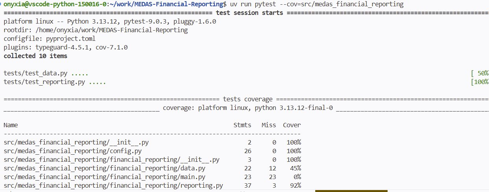

Bien que je vous encourage à douter de tout dans la vie, si cet adage vous est familier, j'espère qu'il ne guide pas votre façon d'écrire du code.

Les tests font en effet partie intégrante du développement logiciel. Ils permettent de confirmer un comportement attendu, prévenir les régressions, documenter implicitement les règles métier et d’avoir confiance dans votre code. 

> Avec autant d'avantages, il serait dommage de ***douter*** de leur utilité ******n’est ce pas ? 🥁
> 

Il en existe plusieurs types, trop pour les lister, nous nous intéresserons particulièrement aux **tests unitaires** et aux **tests d’intégration**. Nous les aborderons ici comme une étape à part entière, même si en pratique vous devriez tester votre code au fil de son développement.

Nous utiliserons `pytest`, la librairie de référence pour structurer tout ça.

Pour commencer je vous invite à vous rendre dans votre Terminal pour structurer votre dossier de tests. On part sur une approche plutôt classique ou 1 module de code à tester = 1 module de test.

```bash
mkdir tests
touch tests/__init__.py
touch tests/test_data.py 
touch tests/test_reporting.py
```

Ajoutez ensuite les dépendances nécessaires à votre projet.

```bash
uv add --dev pytest pytest-cov
```

Pour lancer les tests, voici la commande à retenir :

```bash
uv pytest . # Vous pouvez aussi mettre le chemin d'un module pour lancer les tests sur ce celui ci uniquement
```

INFO

Pourquoi `--dev` ? Ces dépendances ne sont utiles qu'en phase de développement. Une fois votre projet livré en production, `pytest` et `pytest-cov` ne servent à rien. En les excluant, on allège le projet et on évite ainsi d'embarquer du *tooling* inutile dans notre image Docker.

## Les tests unitaires

Les tests unitaires sont les tests les plus granulaires qui existent : ils testent une seule unité de code de manière isolée, typiquement une fonction ou une méthode. L'idée est simple, pour un *input* donné, on vérifie que *l'output* correspond exactement à ce qu'on attend, sans dépendance externe (base de données, API, fichier).

C'est la base de toute stratégie de test : rapides à exécuter, faciles à localiser quand ils échouent et ils forcent à écrire des fonctions qui font une seule chose. Si un test unitaire est difficile à écrire, c'est souvent le signe que la fonction testée est trop complexe.

### test_data.py

```python
"""Tests for data.py"""

import pandas as pd
import pytest

from medas_financial_reporting.financial_reporting.data import clean_data

@pytest.fixture
def raw_df():
    """DataFrame minimal simulant les données brutes."""
    return pd.DataFrame({
        "type_client":  ["PP", "PM", "PP"],
        "score":        ["V",  None,  "R"],
        "score_prev":   [None, "O",   None],
        "id_agent":     ["AUTO", "AGT001", "AUTO"],
        "drc_complet":  [True, False, True],
    })

def test_clean_data_fills_score(raw_df):
    """Les NaN de score sont remplacés par S."""
    result = clean_data(raw_df)
    assert result["score"].iloc[1] == "S"

def test_clean_data_fills_score_prev(raw_df):
    """Les NaN de score_prev sont remplacés par N."""
    result = clean_data(raw_df)
    assert result["score_prev"].iloc[0] == "N"
    assert result["score_prev"].iloc[2] == "N"

def test_clean_data_id_agent(raw_df):
    """Les agents non AUTO sont remplacés par MANUEL."""
    result = clean_data(raw_df)
    assert result["id_agent"].iloc[0] == "AUTO"
    assert result["id_agent"].iloc[1] == "MANUEL"

def test_clean_data_no_nulls(raw_df):
    """Après nettoyage, score et score_prev ne contiennent plus de NaN."""
    result = clean_data(raw_df)
    assert result["score"].isna().sum() == 0
    assert result["score_prev"].isna().sum() == 0

def test_clean_data_preserves_rows(raw_df):
    """clean_data ne supprime pas de lignes."""
    result = clean_data(raw_df)
    assert len(result) == len(raw_df)

```

Quelques explications sur le code ci-dessus.

D'abord, qu'est-ce qu'une **fixture** `pytest` ? C'est un mécanisme qui permet de déclarer un objet réutilisable dans tous nos tests. Dans notre cas, `raw_df` crée un DataFrame minimal qui simule les données brutes. Pourquoi ne pas utiliser les vraies données me diriez-vous? Deux raisons : elles sont trop volumineuses pour des tests unitaires (on verra plus en détails dans la partie CI) et surtout elles introduiraient une dépendance externe or nous voulons ici tester la logique de transformation, pas la lecture d'un fichier distant ou local.

Pour la façon d'écrire les tests, on s'impose une règle simple : un test par comportement attendu. On prévoit également les cas un peu limites comme la suppression involontaire de lignes. Chaque test vérifie une seule chose et son nom dit exactement ce qu'il vérifie ainsi lorsqu’un test échoue, vous savez immédiatement quoi chercher.

Vous vous demandez peut-être pourquoi `get_data` n'est pas testée ici. La réponse est simple : elle fait un appel réseau vers `MinIO`, ce qui en fait un test d'intégration et non un test unitaire. Rappelez vous toujours qu’un test unitaire ne dépend de rien d'externe.

### test_reporting.py

Pour tester nos fonctions  `fill_indicators` et `write_data_to_excel`, on a besoin d’un fichier Excel, là encore on ne va pas utiliser un fichier classique mais plutôt une fixture. 

```python
"""Tests for reporting.py"""

import pandas as pd
import pytest
from openpyxl import Workbook, load_workbook

from medas_financial_reporting.financial_reporting.reporting import (
    fill_indicators,
    write_data_to_excel,
)

@pytest.fixture
def minimal_workbook(tmp_path):
    """Workbook minimal avec les feuilles DATA et Indicateurs."""
    path = tmp_path / "test_reporting.xlsx"
    wb = Workbook()
    wb.active.title = "DATA"
    wb.create_sheet("Indicateurs")
    wb.save(path)
    wb.close()
    return path

@pytest.fixture
def sample_df():
    """DataFrame minimal simulant les données nettoyées."""
    return pd.DataFrame({
        "type_client": ["PP", "PM"],
        "score":       ["V",  "S"],
        "score_prev":  ["N",  "O"],
        "id_agent":    ["AUTO", "MANUEL"],
        "drc_complet": [True, False],
    })

class TestFillIndicators:

    def test_countif_formula(self, minimal_workbook):
        fill_indicators(input_path=minimal_workbook, output_path=minimal_workbook)
        wb = load_workbook(minimal_workbook, data_only=False)
        ws = wb["Indicateurs"]
        assert ws["E8"].value == '=COUNTIF(DATA!B:B, "PP")'
        wb.close()

    def test_sum_formula(self, minimal_workbook):
        """Vérifie que la formule SUM est correctement générée."""
        fill_indicators(input_path=minimal_workbook, output_path=minimal_workbook)
        wb = load_workbook(minimal_workbook, data_only=False)
        ws = wb["Indicateurs"]
        assert ws["E10"].value == "=SUM(E8:E9)"
        wb.close()

    def test_countifs_formula(self, minimal_workbook):
        """Vérifie que la formule COUNTIFS est correctement générée."""
        fill_indicators(input_path=minimal_workbook, output_path=minimal_workbook)
        wb = load_workbook(minimal_workbook, data_only=False)
        ws = wb["Indicateurs"]
        assert ws["E14"].value == '=COUNTIFS(DATA!B:B, "PP", DATA!D:D, "V")'
        wb.close()

    def test_unknown_formula_raises(self, minimal_workbook):
        """Une formule inconnue dans INDICATORS lève une ValueError."""
        from medas_financial_reporting import config
        original = config.INDICATORS.copy()
        config.INDICATORS.append({"row": 99, "formule": "UNKNOWN", "args": []})
        with pytest.raises(ValueError, match="Formule inconnue"):
            fill_indicators(input_path=minimal_workbook, output_path=minimal_workbook)
        config.INDICATORS = original

class TestWriteDataToExcel:

    def test_data_inserted(self, minimal_workbook, sample_df):
        """Vérifie que les données sont bien insérées dans la feuille DATA."""
        from medas_financial_reporting.config import LOCAL_TEMPLATE, LOCAL_TMP_DIR
        import shutil
        LOCAL_TMP_DIR.mkdir(exist_ok=True)
        shutil.copy(minimal_workbook, LOCAL_TEMPLATE)

        write_data_to_excel(sample_df)

        wb = load_workbook(LOCAL_TEMPLATE, data_only=False)
        ws = wb["DATA"]
        assert ws.cell(row=1, column=1).value == "type_client"
        assert ws.cell(row=2, column=1).value == "PP"
        wb.close()
```

Petit twist par rapport au module de test précédent, on utilise ici des classes pour regrouper les tests par fonction. C’est une convention à appliquer en utilisant `pytest.` La logique veut donc que la classe `TestFillIndicators` regroupe tous les tests de `fill_indicators` et `TestWriteDataToExcel` ceux de `write_to_excel`. Ce n’est bien sûr pas obligatoire mais fortement conseillé pour faciliter la lecture et vérifier que vous n’avez rien oublié.

En parlant de rien oublier, ça serait pas mal s’il existait un petit outil nous permettant d’afficher la couverture de nos tests non ? Par exemple on aimerait savoir qu’on a couvert 50, 70 ou 100% de nos fonctionnalités dans un module ? Bonne nouvelle : ça existe. La dépendance que je vous ai fait ajouté avant : `pytest-cov` comme son nom l’indique permet de générer un rapport de couverture de tests. Pour l’exécuter vous pouvez utiliser la commande suivante : `uv run pytest --cov==src/medas_financial_reporting.` 



Quelques critiques sur le rapport généré.

Le rapport généré par `pytest-cov` permet d'avoir une vue d'ensemble sur la couverture de vos tests. Comme nous venons de l'évoquer, il permet de visualiser rapidement si on est passé à côté de quelque chose.

Cette métrique n'est pas à optimiser. Je sais qu'il peut être tentant de vouloir avoir 100% partout, mais cela ne traduit en rien la qualité ni la fiabilité de vos tests. Sachez donc que si un jour quelqu'un vous dit "*C'est quoi ce code sans 100% de coverage ? Je ne veux pas de ça chez moi*", ce discours est nul et non avenu.

 Bien sûr il ne faut pas tomber dans l’extrême opposé avec un coverage très faible en vous disant “*pas de soucis ça marche sur mon ordi ^^*”. 

Le coverage est un indicateur, pas un objectif. Si le projet évolue plus vite que les tests et que le coverage chute, c'est peut-être le signe qu'il faut revoir vos méthodes de développement. Il arrive qu'on laisse les tests de côté au profit d'un "*dev rapide d'une feature*" pour faire plaisir au métier et respecter les délais de livraison. Le coverage sera là pour vous rappeler à l'ordre.


Pour en revenir à notre rapport de coverage, il est vrai que voir `main.py` à 0% peut sembler gênant. Mais si on repense à notre architecture, c'est totalement normal. `main.py` est un module d'orchestration, il appelle des fonctions qui sont elles-mêmes déjà testées. On ne va pas les retester une deuxième fois, ni vérifier qu'on les a bien appelées dans le bon ordre.

La solution est simple : on l'exclut du rapport. 

Dans `pyproject.toml` :

```toml
[tool.coverage.run]
omit = [
    "src/medas_financial_reporting/financial_reporting/main.py",
    "src/storage.py"
]
```

Notez bien cependant que vous signez ici un contrat avec votre vous du futur. En excluant `main.py` du coverage, vous vous engagez à ne jamais y mettre de logique critique qui mériterait d'être testée. `main.py` doit rester un module d'orchestration pure, rien de plus. Le jour où vous sentez l'envie d'y glisser un traitement (même un tout petit), c'est le signe qu'il faut créer une nouvelle fonction dans le bon module.

## Les tests d’intégration

Comme vous l'auriez normalement compris, là où les tests unitaires ne dépendent de rien d'externe, les tests d'intégration vérifient que notre code s'intègre bien avec des éléments extérieurs. `get_data()` en est le parfait exemple : elle effectue un appel réseau vers MinIO. On ne teste pas ici la logique de récupération des données mais le fait que nos composants arrivent bien à communiquer.
Faites un nouveau fichier `tests/test_integration.py` :

```python
"""Tests d'intégration"""

import pandas as pd
import pytest

from medas_financial_reporting.financial_reporting.data import get_data

@pytest.mark.integration
def test_get_data_returns_dataframe():
    """Vérifie que get_data retourne bien un DataFrame non vide."""
    df = get_data()
    assert isinstance(df, pd.DataFrame)
    assert len(df) > 0

@pytest.mark.integration
def test_get_data_expected_columns():
    """Vérifie que les colonnes attendues sont présentes."""
    df = get_data()
    expected = {"type_client", "score", "score_prev", "id_agent", "drc_complet"}
    assert expected.issubset(set(df.columns))

@pytest.mark.integration
def test_get_data_schema_valid():
    """Vérifie que les valeurs respectent le domaine métier attendu."""
    df = get_data()
    assert df["type_client"].isin(["PP", "PM"]).all()
    assert df["drc_complet"].dtype == bool
```

Quelques précisions sur le décorateur utilisé. `@pytest.mark.integration` indique à `pytest` que ces tests doivent être lancés séparément de nos tests unitaires. De la même façon, ajoutez `@pytest.mark.unit` devant chacun de vos tests unitaires pour garder un comportement symétrique.

Modifiez ensuite votre `pyproject.toml` :

```toml
[tool.pytest.ini_options]
markers = [
    "unit: tests unitaires",
    "integration: tests intégration",
]
```

Vos commandes pour lancer les tests deviennent :

```bash
# Tests unitaires uniquement
uv run pytest -m unit

# Tests d'intégration uniquement
uv run pytest -m integration

# Tous les tests
uv run pytest
```

TODO :

INFO POUR ALLEZ + LOIN

Les tests E2E (end to end)

Explications 

```python
"""Tests End-to-End."""

import pytest
from openpyxl import load_workbook

from medas_financial_reporting.config import LOCAL_OUTPUT, S3_BUCKET, S3_OUTPUT_KEY
from medas_financial_reporting.financial_reporting.main import main
from medas_financial_reporting.storage import get_fs

@pytest.fixture(scope="session", autouse=True)
def run_pipeline():
    """Lance le pipeline une seule fois pour tous les tests E2E."""
    main()

@pytest.mark.e2e
def test_reporting_local_exists():
    """Vérifie que le reporting a bien été généré localement."""
    assert LOCAL_OUTPUT.exists()

@pytest.mark.e2e
def test_reporting_uploaded_to_minio():
    """Vérifie que le reporting est bien présent sur MinIO."""
    fs = get_fs()
    assert fs.exists(f"{S3_BUCKET}/{S3_OUTPUT_KEY}")

@pytest.mark.e2e
def test_reporting_contains_expected_sheets():
    """Vérifie que le reporting contient les feuilles attendues."""
    wb = load_workbook(LOCAL_OUTPUT)
    assert "DATA" in wb.sheetnames
    assert "Indicateurs" in wb.sheetnames
    wb.close()

@pytest.mark.e2e
def test_indicators_are_filled():
    """Vérifie que les indicateurs ne sont pas vides."""
    wb = load_workbook(LOCAL_OUTPUT)
    ws = wb["Indicateurs"]
    assert ws["E8"].value is not None
    assert ws["E10"].value is not None
    wb.close()

```

update du pyproject.toml

```toml
[tool.pytest.ini_options]
markers = [
    "unit: tests unitaires",
    "integration: tests intégration",
    "e2e: tests end-to-end",
]
```

RAPPEL GIT TIME pushez commité etc
