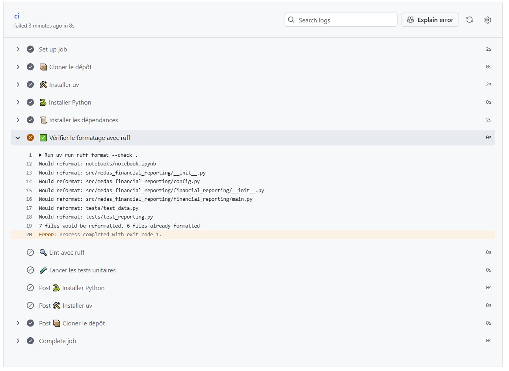
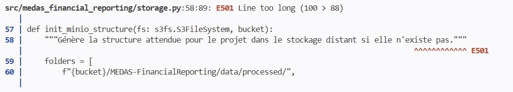
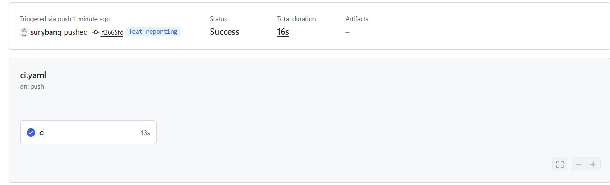

Parmi les avantages des tests, nous avons cité la prévention des régressions. Mais si vous avez bien suivi, vous vous demandez peut-être comment des tests lancés manuellement peuvent prévenir quoi que ce soit. Après tout, rien ne vous empêche de ne pas les lancer du tout.

::: {style="text-align: center;"}

:::

C'est là qu'intervient l'**intégration continue**. L'idée : automatiser un ensemble de vérifications à chaque fois que du code est poussé sur `GitHub`. Nous allons commencer par en automatiser trois : le formatage du code, le lint et les tests unitaires. Mais la `CI` peut aller bien plus loin, comme nous le verrons plus tard : construire et publier une image `Docker`, ou déclencher un déploiement automatique via `ArgoCD`. C'est un outil central dans n'importe quelle équipe data ou software moderne : plus personne ne peut merger du code cassé, mal formaté ou ne respectant pas les règles du projet sans que la `CI` ne le détecte.

Je n'ai pas la prétention de tout couvrir sur ce sujet vaste. L'objectif est de mettre en place une `CI` simple et efficace pour notre développement data.

::: {.callout-tip}
## Pour aller plus loin
Le blog de Stéphane Robert traite ces sujets en profondeur :

- [GitHub Actions](https://blog.stephane-robert.info/docs/pipeline-cicd/github/workflows/)
- [YAML](https://blog.stephane-robert.info/docs/developper/autres-langages/yaml/)
:::

Puisque nous utilisons `GitHub`, nous allons nous appuyer sur **GitHub Actions**. Le principe : on crée un dossier `.github/workflows/` à la racine du projet, dans lequel on place des fichiers YAML décrivant les actions à exécuter. YAML (*Yet Another Markup Language*) est un format de configuration que vous retrouverez partout dans l'écosystème DevOps.

```bash
mkdir -p .github/workflows
touch .github/workflows/ci.yaml
```

## ruff

Avant d'écrire la `CI`, ajoutez `ruff` comme dépendance de développement :

```bash
uv add --dev ruff
```

`ruff` est un linter et formateur Python écrit en `Rust`, extrêmement rapide, qui remplace à lui seul plusieurs outils historiques comme `flake8`, `isort` ou `black`. Nous en avons parlé en cours : c'est un bon exemple de la "rustisation" de l'outillage `Python`.

::: {.callout-caution}
## À vous de jouer
À partir de la [documentation de configuration de `ruff`](https://docs.astral.sh/ruff/configuration/), ajoutez la configuration suivante à votre `pyproject.toml` :

- une longueur de ligne maximale de 88 caractères
- une version cible Python 3.13
- l'exclusion du dossier `notebooks/`
- l'activation des règles `E`, `F` et `I`
:::

<details>
<summary>Solution</summary>

```toml
[tool.ruff]
line-length = 88
target-version = "py313"
exclude = ["notebooks/"]

[tool.ruff.lint]
select = ["E", "F", "I"]
```

</details>

Quelques mots sur cette configuration. `line-length = 88` est la longueur de ligne maximale, valeur par défaut de `black` devenue une convention dans l'écosystème Python. `target-version = "py313"` indique à `ruff` la version cible pour adapter ses règles. On exclut les notebooks du linting via `exclude = ["notebooks/"]` : un notebook est par nature un espace d'exploration, il serait contre-productif d'y appliquer les règles de production. Enfin `select` définit les catégories de règles appliquées : `E` pour les erreurs de style PEP8, `F` pour les erreurs logiques détectées par `pyflakes` (variables non utilisées, imports manquants) et `I` pour le tri automatique des imports.

## ci.yaml

Notre CI effectuera trois vérifications à chaque push : le formatage du code, le lint avec `ruff` et les tests unitaires avec `pytest`. Vous remarquerez que les tests d'intégration sont exclus : ils nécessitent une connexion réseau et des credentials `MinIO` qu'on ne veut pas exposer dans la `CI` pour des raisons de sécurité évidentes.

<details>
<summary>Voir le code</summary>

```yaml
name: CI

on:
  push:
    branches:
      - "**"
  pull_request:
    branches:
      - main
      - development

jobs:
  ci:
    runs-on: ubuntu-latest

    steps:
      - name: 📦 Cloner le dépôt
        uses: actions/checkout@v4

      - name: 🛠 Installer uv
        uses: astral-sh/setup-uv@v6

      - name: 🐍 Installer Python
        uses: actions/setup-python@v5
        with:
          python-version: "3.13"

      - name: 📜 Installer les dépendances
        run: uv sync --all-groups

      - name: ✅ Vérifier le formatage avec ruff
        run: uv run ruff format --check .

      - name: 🔍 Lint avec ruff
        run: uv run ruff check .

      - name: 🧪 Lancer les tests unitaires
        run: uv run pytest -m unit
```
</details>

Concernant la structure du fichier : la partie supérieure `on` spécifie le **quand** et le **où**, c'est-à-dire sur quel événement et sur quelles branches la `CI` se déclenche. La partie `jobs` spécifie le **quoi**, les étapes à exécuter dans l'ordre.

On indique à `GitHub` d'utiliser `ubuntu-latest` : on lui demande ainsi d'instancier un **runner**, une petite machine virtuelle éphémère qui exécute les étapes de la `CI`. Vous n'avez rien à gérer, `GitHub` s'en occupe.

Commitez, pushez, puis rendez-vous dans l'onglet **Actions** de votre repo. Félicitations, vous venez peut-être de lancer votre toute première `CI`. Par contre, pas de chance : elle échoue.

::: {style="text-align: center;"}

:::

Pas d'inquiétude, c'est même une bonne nouvelle : la `CI` a détecté que le code n'était pas formaté correctement, on peut donc dire qu'elle a fait son job. Vous vous dites peut-être : *"on connaît la commande pour reformater le code, pourquoi ne pas l'utiliser directement dans la CI ?"*

::: {.callout-important}
## La CI ne modifie jamais votre code
La `CI` a pour rôle de **vérifier**, jamais de **modifier** votre code. Imaginez les complications : des modifications automatiques sur vos branches, des commits générés par la `CI`, des conflits en cascade. Une `CI` doit constater un problème et échouer, à vous de corriger. Pour formater automatiquement au bon moment (avant le commit), on utilise un autre outil : `prek`.
:::

## prek

`prek` est un gestionnaire de `hooks` `Git`. Un `hook` est une action déclenchée automatiquement à un moment précis de votre workflow `Git`. Ici, on veut qu'avant chaque `git commit` le code soit automatiquement vérifié et formaté. Si quelque chose ne va pas, le commit est bloqué : vous corrigez, vous recommittez. Plus personne ne pousse du code mal formaté sans s'en rendre compte.

::: {.callout-note}
## Pourquoi `prek` plutôt que `pre-commit` ?
`pre-commit` est l'outil historique. `prek` fait la même chose mais il est écrit en `Rust` (donc beaucoup plus rapide) et utilise `uv` pour gérer ses dépendances, ce qui tombe bien puisque c'est déjà notre outil de référence.
:::

Installez `prek` via `uv` :

```bash
uv tool install prek
export PATH="/home/onyxia/.local/bin:$PATH"  # si vous n'êtes pas sur Onyxia, adaptez le chemin
prek install
```

Créez ensuite un fichier `.pre-commit-config.yaml` à la racine du projet :
<details>
<summary>Voir le code</summary>

```yaml
repos:
  - repo: https://github.com/astral-sh/ruff-pre-commit
    rev: v0.11.0
    hooks:
      - id: ruff
        args: [--fix]
      - id: ruff-format
```
</details>

Testez en lançant manuellement les `hooks` sur tout le projet :

```bash
prek run --all-files
```

`prek` a lancé les commandes `ruff` pour vous. En revanche, plusieurs lignes ne peuvent pas être résolues automatiquement, notamment les erreurs `E501` qui signalent une ligne trop longue.

::: {style="text-align: center;"}

:::

Une ligne longue est parfois acceptable, par exemple pour une docstring sur une seule ligne. L'astuce, à utiliser avec parcimonie, consiste à ajouter le commentaire `# noqa: E501` en fin de ligne pour dire à `ruff` de l'ignorer. Notez qu'il faut **deux espaces** entre le dernier caractère et le commentaire :

```python
"""Génère la structure attendue pour le projet dans le stockage distant si elle n'existe pas."""  # noqa: E501
```

Une fois tout corrigé, refaites vos commits et pushez pour vérifier que la `CI` accepte les changements.

::: {style="text-align: center;"}

:::

::: {.callout-tip}
## Documentation des outils
- [GitHub Actions](https://docs.github.com/en/actions)
- [ruff configuration](https://docs.astral.sh/ruff/configuration/) et [liste des règles](https://docs.astral.sh/ruff/rules/)
- [uv](https://docs.astral.sh/uv/)
- [prek](https://github.com/j178/prek)
- [pre-commit](https://pre-commit.com/)
:::

::: {.callout-tip}
## Git time
Si tout est au vert, ouvrez une PR pour merger votre avancement sur `development` puis sur `main`.
:::