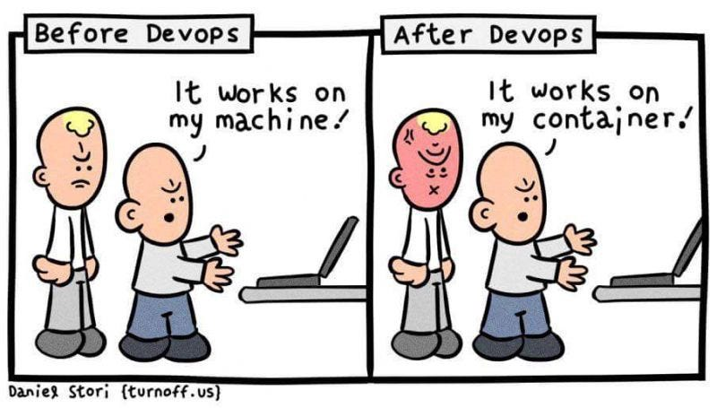
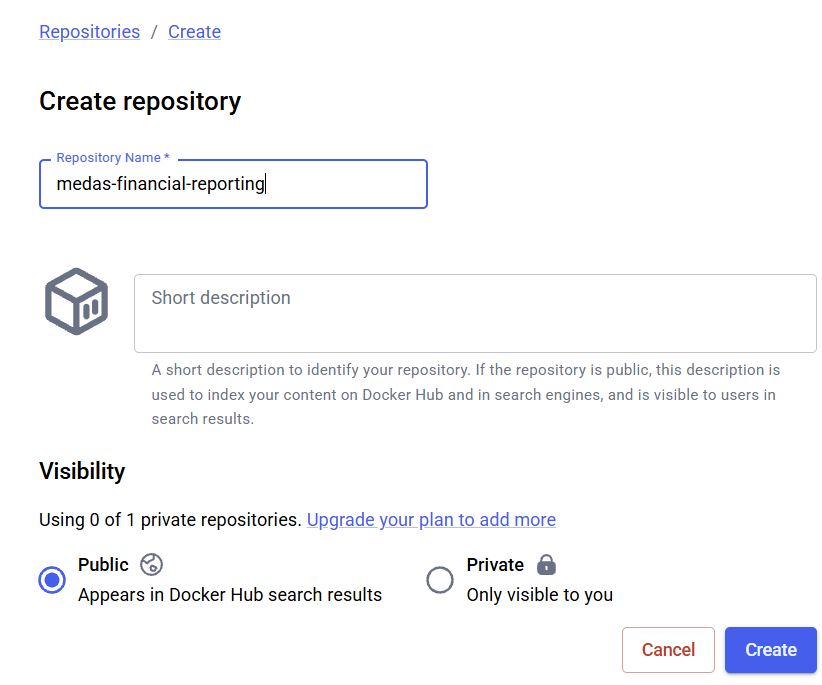
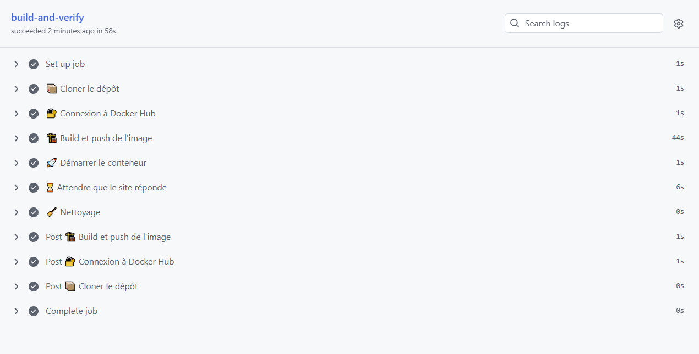

> Une précision avant de commencer. Mon objectif n'est pas de vous apprendre Docker dans son intégralité, le sujet est bien trop vaste pour tenir dans cette section et mériterait un cours à lui seul. Ce que je veux, c'est vous faire manipuler Docker dans un cas concret et utile : conteneuriser notre data product pour le déployer.

## Pourquoi conteneuriser ?

Jusqu'ici, notre application tourne très bien... sur notre machine. Le problème classique pointe le bout de son nez : "ça marche chez moi". Entre votre poste, celui d'un collègue et le serveur qui hébergera l'app, les versions de `Python` diffèrent (normalement non vu qu'on utilise `uv` !), les dépendances système ne sont pas les mêmes, une variable d'environnement manque... et ce qui tournait parfaitement en local refuse de démarrer ailleurs.

**Docker** règle ce problème en empaquetant l'application *et* tout son environnement (la version de `Python`, les dépendances, la configuration) dans une **image** : un paquet autonome et reproductible. Cette image tourne ensuite à l'identique partout, sur votre machine comme sur le cluster.

::: {.callout-note}
## Image et conteneur, quelle différence ?
Deux mots qu'on va employer en permanence, autant les distinguer tout de suite. L'**image** est le modèle figé, la recette empaquetée (notre application prête à tourner). Le **conteneur** est une instance vivante de cette image, une exécution concrète. Une image, plusieurs conteneurs : un peu comme une classe et ses instances, ou un moule et les gâteaux qu'on en tire.
:::

Sans image, impossible de livrer notre data product sur le cluster de façon fiable. C'est donc l'étape qui transforme notre code "qui marche chez nous" en quelque chose de déployable n'importe où.


::: {.callout-note}
## Docker n'est pas magique
Il faut quand même nuancer un peu ces propos, ils ne sortent pas seulement de mes doigts ? C'est les explications que vous retrouverez un peu partout. Il faut toutefois savoir que conteneuriser réduit drastiquement les "ça marche chez moi", mais ne les élimine pas. L'architecture de la machine (ARM vs x86), tout ce qui vit *hors* du conteneur (réseau, volumes, secrets, services voisins) ou un build mal figé peuvent encore vous jouer des tours. Finalement, la bonne promesse de Docker n'est pas "ça marchera partout" mais "le même environnement applicatif partout". Sans vouloir vous spoiler, Vous en ferez d'ailleurs l'expérience très vite : notre image va build et démarrer correctement, sans que l'application soit pour autant pleinement fonctionnelle. 👀

::: {style="text-align: center;"}

:::

:::


::: {.callout-tip}
## Pour pratiquer Docker

Si le sujet vous intéresse, je vous recommande vivement [les guides du labs Docker](https://docs.docker.com/guides/). Ils sont très intuitifs et construits autour de cas d'usage précis.
:::

## Où faire tourner Docker ?

On a un problème : `Onyxia` ne permet pas d'utiliser des images `Docker` à la volée dans un pod. Pour itérer avec `Docker`, nous devons donc nous rabattre sur d'autres solutions. Voici un petit tour d’horizon des options qui s’offrent à nous :

- **Docker Desktop** installé sur votre machine. C'est la solution la plus complète mais elle suppose de pouvoir installer le logiciel sur votre poste, ce qui n’est pas toujours le cas donc on oublie.
- [**Le bac à sable Docker**(*Play with Docker*)](https://labs.play-with-docker.com/) permettait autrefois de tester en ligne sans rien installer, mais il a été décommissionné.
- [**LabEX**](https://labex.io/tutorials/docker-online-docker-playground-372912) offre un service similaire à Play with Docker mais son temps d'utilisation est trop limité pour notre usage, nous ne nous en servirons donc pas.

À la place, je vous propose une approche un peu différente : utiliser **notre propre CI** comme banc d'essai et nous adonner à ce qui ressemble à du pur *die and retry*. On pousse, la CI build, ça casse, on corrige, on repousse, jusqu'à ce que ça passe.

::: {.callout-note}
En realité ces étapes d’essais/erreurs seront plutôt invisible pour vous, j’espère bien pouvoir vous donner des consignes assez clairs pour que vous n’ayez pas à subir ça.

::: {style="text-align: center;"}

:::

:::


## Ce qu'on va faire (et ce qu'on ne pourra pas faire)

Le plan est le suivant : construire une image, l'envoyer sur [`Docker Hub`](https://hub.docker.com/) grâce à notre `CI` et vérifier via cette dernière que l'image **build** correctement et que le **site répond**.

Soyons clairs sur les limites de l'exercice : nous ne pourrons pas tester la bonne exécution complète de notre programme de cette façon. La `CI` nous dira seulement que l'image est **valide** (elle se construit et démarre), pas qu'elle fonctionne de bout en bout. De toute façon, on le sait dès le départ : tout ne sera pas fonctionnel car rappelez-vous que nous avons fait le choix de ne pas injecter nos credentials `MinIO` pour des raisons de sécurité. Il faudra donc en monter un nous-mêmes, ce que nous ferons aussi avec `Docker` mais plus tard.
```{mermaid}
%%| label: fig-docker-ci-loop
%%| fig-cap: "La boucle die and retry : on itère sur le Dockerfile via la CI jusqu'à ce que l'image build et que le site réponde."
flowchart TD
    A[Modifier le Dockerfile] --> B[Commit et push sur feat-docker]
    B --> C[La CI build l'image]
    C --> D{Le build réussit ?}
    D -->|Non| E[Lire les logs de la CI et identifier l'erreur]
    E --> A
    D -->|Oui| F[Push de l'image sur DockerHub]
    F --> G[La CI démarre le conteneur]
    G --> H{Le site répond ?}
    H -->|Non| E
    H -->|Oui| I[Image valide]
```

::: {.callout-note}

## C'est quoi DockerHub ?

Docker Hub est un ***image registry*** (registre d'images) : un espace de stockage en ligne où l'on publie et récupère des images Docker, un peu comme GitHub l'est pour le code source. Quand notre `CI` aura construit l'image de notre application, elle l'y poussera. N'importe quel environnement capable de tirer une image (votre cluster, un collègue, un serveur) pourra alors la récupérer par son nom. C'est le maillon qui relie la construction de l'image à son déploiement. Pour information, en entreprise vous n’utiliserez que très rarement `DockerHub`, vous aurez votre propre *registry* comme `Artifactory` ou `Harbor`, peut-être que ces noms vous évoque quelque chose.
:::

::: {.callout-tip}
## Les bonnes habitudes

On ne change pas nos habitudes : tout passe par une branche dédiée selon le workflow `feat-* → development → main`. On crée donc `feat-docker` depuis `development`.

```bash
git switch -c feat-docker
```

::: {style="text-align: center;"}
{width=30%}
:::

:::

## Le Dockerfile

Créez un fichier nommé `Dockerfile` à la racine du projet. (le D majuscule est important)

::: {.callout-note}

## C'est quoi un Dockerfile ?

Un **Dockerfile** est en quelque sorte une recette : un fichier texte qui décrit, étape par étape, comment construire l'image de votre application. Chaque instruction (`FROM`, `COPY`, `RUN` ...) part d'une base et ajoute quelque chose par-dessus.

Chaque instruction crée une **layer** (couche). Une image `Docker` est en réalité un empilement de couches, chacune représentant une modification du système de fichiers. L'intérêt : les couches sont **mises en cache.**

C'est pour ça que l'ordre des instructions compte : on place les étapes qui changent rarement (installation des dépendances) avant celles qui changent souvent (copie du code), pour profiter au maximum du cache et accélérer les builds.

Je vous redirige une fois de plus vers [le blog de Stéphane Robert](https://blog.stephane-robert.info/docs/conteneurs/images-conteneurs/) pour en savoir plus
:::

<details>
<summary>Voir le Dockerfile</summary>

```Dockerfile
# Image de base : Python 3.13 en version slim
FROM python:3.13-slim

# Copie du binaire uv depuis l'image officielle (pas besoin de l'installer à la main)
COPY --from=ghcr.io/astral-sh/uv:latest /uv /uvx /bin/

# Répertoire de travail dans le conteneur
WORKDIR /app

# Copie des fichiers de dépendances d'abord (pour profiter du cache des layers)
COPY pyproject.toml uv.lock ./

# Installation des dépendances (sans les dépendances de dev)
RUN uv sync --frozen --no-dev --no-install-project

# Copie du reste du code source
COPY . .

# Installation du projet lui-même
RUN uv sync --frozen --no-dev

# Création d'un utilisateur non-root et attribution des droits sur /app
RUN useradd --create-home --uid 1000 appuser \
    && chown -R appuser:appuser /app

# On bascule sur cet utilisateur : tout ce qui suit tourne sans privilèges admin
USER appuser

# Port exposé par Streamlit
EXPOSE 8501

# Commande de démarrage : on réutilise notre entrypoint uv
CMD ["uv", "run", "app"]
```

</details>

::: {.callout-important}

## **Sécurité : ne jamais tourner en root**

Par défaut, un conteneur `Docker` exécute son processus en tant que **root**. C'est pratique mais dangereux : si une faille permet à un attaquant de sortir du conteneur (*container escape*), il se retrouve avec les pleins pouvoirs sur la machine hôte. Le principe du **moindre privilège** veut qu'un processus ne dispose que des droits strictement nécessaires à son fonctionnement.

C'est pourquoi nous créons un utilisateur dédié `appuser`, sans privilèges, et nous basculons dessus avec l'instruction `USER` avant de lancer l'application. À partir de cette ligne, tout s'exécute sans les droits administrateur. Notre application `Streamlit` n'a besoin de rien de plus pour tourner, autant ne pas lui donner les clés de la maison.

C'est un réflexe que vous devez intégrer le plus tôt possible : on ne déploie pas un conteneur qui tourne en *root*.
:::


::: {.callout-tip}

## **Le .dockerignore, le pendant du .gitignore**

Notre instruction `COPY . .` copie tout le contenu du projet dans l'image. Or beaucoup de choses n'ont rien à y faire : le site Quarto (`_site/`, `pages/`, `images/`), l'environnement virtuel `.venv/`, les caches, le dossier `.git/`, les notebooks d'exploration...

On crée donc un fichier `.dockerignore` à la racine, qui fonctionne exactement comme un `.gitignore` mais pour Docker : il liste ce qui doit être exclu de l'image. Les bénéfices sont concrets : une image plus **légère**, des builds plus **rapides** (moins de fichiers à copier, meilleur usage du cache) et une surface d'attaque **réduite** puisqu'on n'embarque que le strict nécessaire à l'exécution.

<details>
<summary>Voir le .dockerignore</summary>

```
# Environnements et caches Python
.venv/
__pycache__/
*.pyc
.pytest_cache/
.ruff_cache/
.coverage

# Site Quarto
_site/
.quarto/
pages/
images/
index.qmd
_quarto.yml
styles.css

# Notebooks
notebooks/

# Git et CI
.git/
.github/
.pre-commit-config.yaml

# Fichiers temporaires et divers
tmp/
.cache/
todo.md
Dockerfile
.dockerignore
```
</details>

La règle est simple : si ce n'est pas indispensable pour faire **tourner** l'application en production, ça n'a pas sa place dans l'image.
:::

## Automatiser la livraison de l’image docker dans Dockerhub

Comme nous l'avions évoqué, il faut *push* l'image dans `Dockerhub`. Nous avons d'abord besoin de créer un compte sur ce dernier pour pouvoir stocker nos images.

::: {.callout-caution}

## À vous de jouer
- Se rendre sur [`Dockerhub`](https://hub.docker.com/) et créer un compte. Il est recommandé d’associer ce compte à votre compte `Github`.
- Créer un dépôt public `medas-financial-reporting`

::: {style="text-align: center;"}
{width=60%}
:::

- Aller dans les paramètres de votre compte et cliquer, à gauche, sur `Personnal access tokens`
- Créer un jeton personnel d’accès, ne fermez pas l’onglet en question, vous ne pouvez voir sa valeur qu’une fois.
- Dans le dépôt `Github` de votre repo, cliquer sur l’onglet *Settings* et cliquer, à gauche, sur *Secrets and variables* puis dans le menu déroulant en dessous sur *Actions*. Sur la page qui s’affiche, aller dans la section `Repository secrets`
- Créer un jeton `DOCKERHUB_TOKEN` à partir du jeton que vous aviez créé sur `Dockerhub`. Valider
- Créer un deuxième secret nommé `DOCKERHUB_USERNAME` ayant comme valeur le nom d’utilisateur que vous avez créé sur `Dockerhub`.
:::

### docker.yaml

Maintenant que notre compte `DockerHub` et notre repo `GitHub` sont correctement configurés, nous pouvons écrire le mécanisme de *build* et de *push*.

<details>
<summary>Voir le code</summary>

```yaml
name: Docker

on:
  push:
    branches:
      - feat-docker
      - development
      - main
  workflow_dispatch:

jobs:
  build-and-verify:
    runs-on: ubuntu-latest

    steps:
      - name: 📦 Cloner le dépôt
        uses: actions/checkout@v4

      - name: 🔐 Connexion à Docker Hub
        uses: docker/login-action@v3
        with:
          username: ${{ secrets.DOCKERHUB_USERNAME }}
          password: ${{ secrets.DOCKERHUB_TOKEN }}

      - name: 🏗️ Build et push de l'image
        uses: docker/build-push-action@v6
        with:
          context: .
          push: true
          tags: ${{ secrets.DOCKERHUB_USERNAME }}/medas-financial-reporting:latest

      - name: 🚀 Démarrer le conteneur
        run: |
          docker run -d --name medas-app \
            -p 8501:8501 \
            ${{ secrets.DOCKERHUB_USERNAME }}/medas-financial-reporting:latest

      - name: ⏳ Attendre que le site réponde
        run: |
          for i in $(seq 1 30); do
            if curl -sf http://localhost:8501/_stcore/health; then
              echo "Hello there !"
              exit 0
            fi
            echo "Tentative $i : le site ne répond pas encore..."
            sleep 2
          done
          echo "Tout est chaos"
          docker logs medas-app
          exit 1

      - name: 🧹 Nettoyage
        if: always()
        run: docker rm -f medas-app
```

</details>

Déroulons ce que fait ce workflow.

Le bloc `on` définit les déclencheurs : la `CI` se lance sur les branches `feat-docker`, `development` et `main`, ainsi que manuellement via `workflow_dispatch`. Pendant nos itérations, c'est surtout `feat-docker` qui nous intéresse.

Le job `build-and-verify` enchaîne ensuite plusieurs étapes. On commence par **cloner le dépôt**, puis on se **connecte à `DockerHub`** grâce à nos deux secrets `DOCKERHUB_USERNAME` et `DOCKERHUB_TOKEN`.

Vient ensuite le cœur du pipeline : le **build et le push de l'image**. L'action `docker/build-push-action` construit l'image à partir de notre `Dockerfile` et la publie directement sur `DockerHub` sous le tag `latest`.

Les deux étapes suivantes constituent notre **smoke test**, c'est-à-dire la vérification minimale que nous avions annoncée. On **démarre le conteneur** en exposant le port `8501`, puis on **attend que le site réponde** : on interroge en boucle l'endpoint de santé de Streamlit (`/_stcore/health`), jusqu'à 30 fois avec deux secondes de pause. Dès qu'il renvoie une réponse, c'est gagné. Si après une minute il n'a toujours rien renvoyé, on affiche les logs du conteneur pour diagnostiquer et on fait échouer le job.

::: {style="text-align: center;"}
{width=40%}
:::

Enfin, l'étape de **nettoyage** supprime le conteneur. Le `if: always()` garantit qu'elle s'exécute même si une étape précédente a échoué, pour ne pas laisser de conteneur fantôme derrière nous.

Pour déclencher ce workflow, il suffit de commit et push votre code. Rendez-vous ensuite dans l'onglet **Actions** de votre repo : si vous obtenez le même affichage que moi, félicitations, vous venez de décrocher une nouvelle étoile à votre tableau de chasse.

::: {style="text-align: center;"}

:::