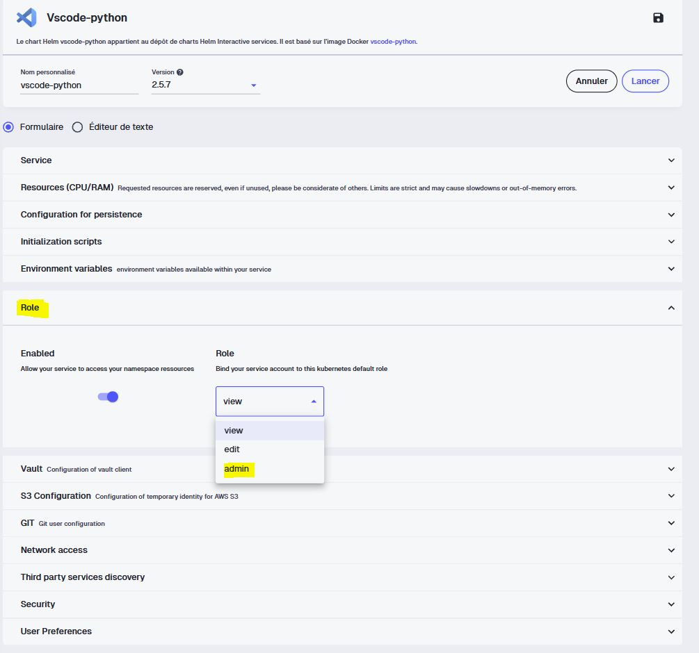
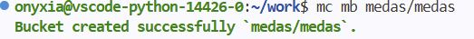

::: {.callout-warning}
## En cours de rédaction
Cette section est encore en cours, certains passages et captures viendront la compléter.
:::

>Comme pour `Docker`, je ne vais pas vous apprendre `Kubernetes` et `ArgoCD` dans leur intégralité, ce sont des univers à part entière. Mon objectif est que vous sachiez vous en servir dans notre cas concret : déployer automatiquement notre application et la rendre accessible via une URL.

## C'est quoi ArgoCD ?

`ArgoCD` est un **opérateur de déploiement continu** pour `Kubernetes`. Si vous connaissez `Airflow`, `Dagster`, `Prefect` ou `Luigi` pour orchestrer des pipelines de données, voyez `ArgoCD` comme un orchestrateur d'un autre genre : il orchestre le **déploiement de composants** (images `Docker`, charts `Helm`) sur un cluster `Kubernetes`.

::: {.callout-note}
## Le principe GitOps
ArgoCD repose sur l'approche **GitOps**. L'idée tient en une phrase : un dépôt `Git` fait office de **source de vérité unique** de l'état voulu de l'application. Tout changement poussé sur ce dépôt doit se répercuter immédiatement sur le déploiement réel.

On ne modifie plus le cluster à la main : on décrit l'état souhaité dans `Git` et `ArgoCD` se charge de faire converger le cluster vers cet état. L'historique `Git` devient alors l'historique exact de ce qui tourne en production, ce qui est précieux pour l'audit et le retour arrière.
:::

## Le workflow : deux dépôts

C'est ici qu'intervient une nouveauté d'architecture. Jusqu'à présent, tout vivait dans un seul dépôt. Pour le déploiement `GitOps`, on en introduit un **second**, dédié au déploiement.

- Le **dépôt applicatif** (le nôtre, `MEDAS-Financial-Reporting`) contient le code et la `CI` qui build et push l'image sur `DockerHub`.
- Le **dépôt GitOps** (que nous allons créer) contient uniquement les **manifests Kubernetes** : la description de comment notre application doit tourner sur le cluster.

`ArgoCD` surveille ce dépôt `GitOps`. Dès qu'un changement y est poussé, il met à jour le déploiement. C'est ça, le **déploiement continu** (CD).

```{mermaid}
%%| label: fig-gitops-flow
%%| fig-cap: "La chaîne CI/CD complète : du push de code jusqu'à l'application accessible, en passant par les deux dépôts."
flowchart TD
    DEV([Vous poussez du code]) --> APP[Dépôt applicatif]
    APP -->|"la CI build l'image"| H[(Docker Hub)]
    H -->|"met à jour le tag de l'image"| GITOPS[Dépôt GitOps]
    GITOPS -->|"surveillé par"| ARGO[ArgoCD]
    ARGO -->|"applique l'état désiré"| K[Cluster Kubernetes]
    H -.->|"le cluster tire l'image"| K
    K --> U([Application accessible])
```

::: {.callout-tip}
## Pourquoi séparer les deux dépôts ?
On pourrait être tenté de tout mettre dans un seul repo. La séparation est pourtant une bonne pratique GitOps : elle découple le **cycle de vie du code** de celui du **déploiement**. Votre code peut évoluer sans redéployer et votre configuration de déploiement peut changer (montée de version, scaling) sans toucher au code. L'historique de chaque dépôt reste clair et dédié à une seule préoccupation.
:::

## Lancer ArgoCD sur Onyxia

::: {.callout-caution}
## À vous de jouer
- Rendez-vous sur la page **Mes services** d'`Onyxia`
- Lancez un service **ArgoCD** en laissant les configurations par défaut
- Notez les identifiants de connexion fournis au lancement
:::

## Créer le repo GitOps

::: {.callout-caution}
## À vous de jouer
- Sur `GitHub`, créez un nouveau dépôt nommé `medas-financial-reporting-deployment`
- Ajoutez-y un dossier `deployment/` qui contiendra nos manifests `Kubernetes`.
:::

Nous allons y placer quatre fichiers de déploiement `Kubernetes`. Avant de copier les solutions, un mot sur le rôle de chacun. N'hésitez pas à vous appuyer sur la [documentation officielle Kubernetes](https://kubernetes.io/docs/concepts/workloads/controllers/deployment/) pour les écrire.

- `minio.yaml` déploie notre instance de stockage `MinIO` et son service interne, sur lequel l'application écrit les données nettoyées et le reporting.
- `deployment.yaml` décrit **quoi** déployer : quelle image, combien de réplicas, quelles variables d'environnement.
- `service.yaml` expose les pods **à l'intérieur** du cluster, en donnant un point d'accès stable.
- `ingress.yaml` expose le service **à l'extérieur** en associant une URL publique à notre application.


### La gestion des Secrets

Nos credentials `MinIO` ne doivent jamais finir en clair dans un dépôt, même privé (je l'ai déjà mais c'est au cas où pour ceux du fond). On ne les met donc pas dans nos manifests : on crée un **Secret Kubernetes** directement dans notre namespace et nos manifests le référenceront sans jamais contenir sa valeur.

::: {.callout-note}
## Un service VS Code admin sur votre namespace
La création d'un `Secret Kubernetes` demande des droits d'administration sur le namespace. Sur `Onyxia`, vous pouvez lancer un service `VS Code` en activant le **rôle admin** sur votre propre namespace en passant par un nouveau service et en sélectionnant le bon rôle. Vous aurez ainsi accès à la commande `kubectl create secret`.

::: {style="text-align: center;"}
{width=50%}
:::

:::

::: {.callout-caution}
## À vous de jouer
- Depuis le catalogue `Onyxia`, lancez un service **VS Code** avec le **rôle admin** sur votre namespace
- Ouvrez son `Terminal` et créez le secret (pensez à bien garder votre mot de passe):

```bash
kubectl create secret generic minio-credentials \
  --from-literal=access-key=medas-admin \
  --from-literal=secret-key=changez-moi-par-un-mot-de-passe-solide \
  -n user-<username>
```

- Vérifiez qu'il existe :

```bash
kubectl get secret minio-credentials -n user-<username>
```
- Clonez votre dépôt `GitOps` dans ce service :

```bash
git clone <votre_repo_gitops>
```

:::

::: {.callout-note}
## Deux clés, et un mot de passe d'au moins 8 caractères
Ce secret sert à la fois à MinIO (ses identifiants administrateur `MINIO_ROOT_USER` / `MINIO_ROOT_PASSWORD`) et à l'application (son `access-key` / `secret-key`). Comme nos credentials sont durables, pas de token de session : deux clés suffisent. Attention, `MinIO` refuse de démarrer si le mot de passe fait moins de 8 caractères.
:::

::: {.callout-tip}
## Une limite à connaître
Créer le secret à la main fonctionne très bien, mais notez qu'il ne vit pas dans votre dépôt `GitOps`. Quelqu'un qui clonerait votre dépôt de déploiement n'aurait donc pas ce secret : ce n'est pas du pur `GitOps`. C'est un compromis par soucis technique sur ce que l'on a le droit de faire sur `Onyxia`. La gestion sécurisée et reproductible passerait par `Vault`[^vault] ou un opérateur dédié.
:::

[^vault]: `Vault` est un gestionnaire de secrets développé par HashiCorp. Il stocke de façon chiffrée et centralisée les informations sensibles (mots de passe, clés d'API, tokens) et contrôle finement qui peut y accéder. Sur SSP Cloud, c'est le coffre-fort derrière la page [Mes secrets](https://docs.sspcloud.fr/content/secrets.html). Nous ne pouvons pas l'utiliser dans le cadre de notre application car il est utilisé uniquement au lancement d'un formulaire de service, ce qui ne colle pas à la situation actuelle.

### Le déploiement de MinIO

On déploie ensuite `MinIO` et son service. MinIO expose un seul port : `9000` pour l'API S3 (celle que notre app utilise). Les identifiants administrateur de `MinIO` sont lus depuis le secret qu'on vient de créer.

<details>
<summary>Voir le minio.yaml</summary>

```yaml
apiVersion: apps/v1
kind: Deployment
metadata:
  name: minio-medas-usid0f
spec:
  replicas: 1
  selector:
    matchLabels:
      app: minio-medas-usid0f
  template:
    metadata:
      labels:
        app: minio-medas-usid0f
    spec:
      containers:
        - name: minio
          image: minio/minio:latest
          args: ["server", "/data"]
          env:
            - name: MINIO_ROOT_USER
              valueFrom:
                secretKeyRef:
                  name: minio-credentials
                  key: access-key
            - name: MINIO_ROOT_PASSWORD
              valueFrom:
                secretKeyRef:
                  name: minio-credentials
                  key: secret-key
          ports:
            - containerPort: 9000
          volumeMounts:
            - name: data
              mountPath: /data
      volumes:
        - name: data
          emptyDir: {}
---
apiVersion: v1
kind: Service
metadata:
  name: minio-medas-usid0f
spec:
  selector:
    app: minio-medas-usid0f
  ports:
    - name: api
      port: 9000
      targetPort: 9000
```

</details>

::: {.callout-caution}
## Stockage éphémère
Le volume est ici un `emptyDir`, un stockage temporaire lié au cycle de vie du pod. Si le pod `MinIO` redémarre, les données sont perdues. C'est suffisant pour notre démonstration, puisque le pipeline régénère les données à chaque exécution. Pour un usage réel, on utiliserait un `PersistentVolumeClaim`. (Enfin on aimerait surtout pouvoir se brancher à un stockage distant distribué et permanent à toutes nos applications, c'est très atypique d'attribuer un `MinIO` pour une seule application.)
:::

### Créer le bucket

Votre `MinIO` fraîchement déployé est vide. L'application a besoin que le bucket existe avant de pouvoir y écrire.

::: {.callout-caution}
## À vous de jouer
Depuis le terminal de votre VS Code, créez le bucket :

```bash
mc alias set medas http://minio-medas-usid0f:9000 medas-admin <votre_mot_de_passe_solide>
mc mb medas/medas
mc ls medas
```

Le `mc ls medas` doit afficher votre bucket `medas`, confirmant qu'il a bien été créé.

::: {style="text-align: center;"}

:::

:::

### deployment.yaml

C'est le manifest central : il déclare notre conteneur, à partir de l'image publiée sur `DockerHub`.

<details>
<summary>Voir le deployment.yaml</summary>

```yaml
apiVersion: apps/v1
kind: Deployment
metadata:
  name: medas-financial-reporting
spec:
  replicas: 1
  selector:
    matchLabels:
      app: medas-financial-reporting
  template:
    metadata:
      labels:
        app: medas-financial-reporting
    spec:
      containers:
        - name: medas-financial-reporting
          image: <votre_username_github>/medas-financial-reporting:latest
          ports:
            - containerPort: 8501
          env:
            - name: AWS_S3_ENDPOINT
              value: "http://minio-medas-usid0f:9000"
            - name: S3_BUCKET
              value: "medas"
            - name: AWS_ACCESS_KEY_ID
              valueFrom:
                secretKeyRef:
                  name: minio-credentials
                  key: access-key
            - name: AWS_SECRET_ACCESS_KEY
              valueFrom:
                secretKeyRef:
                  name: minio-credentials
                  key: secret-key
```

</details>

### service.yaml

<details>
<summary>Voir le service.yaml</summary>

```yaml
apiVersion: v1
kind: Service
metadata:
  name: medas-financial-reporting
spec:
  selector:
    app: medas-financial-reporting
  ports:
    - port: 80
      targetPort: 8501
```

</details>

### ingress.yaml

C'est ce fichier qui définit l'URL publique. L'hôte renseigné sera l'URL permettant d'accéder à votre application sur votre navigateur.

<details>
<summary>Voir le ingress.yaml</summary>

```yaml
apiVersion: networking.k8s.io/v1
kind: Ingress
metadata:
  name: medas-financial-reporting

spec:
  ingressClassName: nginx
  tls:
    - hosts:
      - <votre_url_a_saisir>.lab.sspcloud.fr
  rules:
    - host: <votre_url_a_saisir>.lab.sspcloud.fr
      http:
        paths:
          - path: /
            pathType: Prefix
            backend:
              service:
                name: medas-financial-reporting
                port:
                  number: 80
```

</details>

### Un ajustement de code nécessaire

Notre fonction `get_fs()` dans `storage.py` force le préfixe `https://` sur l'endpoint or notre `MinIO` interne tourne en `http://`. On l'assouplit pour accepter les deux et pour gérer l'absence de token de session :

```python
def get_fs() -> s3fs.S3FileSystem:
    """Retourne un filesystem S3 authentifié."""
    endpoint = S3_ENDPOINT
    if not endpoint.startswith(("http://", "https://")):
        endpoint = f"https://{endpoint}"
    return s3fs.S3FileSystem(
        endpoint_url=endpoint,
        key=AWS_ACCESS_KEY_ID,
        secret=AWS_SECRET_ACCESS_KEY,
        token=AWS_SESSION_TOKEN or None,
    )
```


## Déclarer l'application dans ArgoCD

À la racine de votre dépôt `GitOps`, créez un fichier `application.yaml`. C'est lui qui dit à `ArgoCD` quoi surveiller et où déployer.

<details>
<summary>Voir le application.yaml</summary>

```yaml
apiVersion: argoproj.io/v1alpha1
kind: Application
metadata:
  name: medas-financial-reporting
spec:
  project: default
  source:
    repoURL: https://github.com/<votre_username_github>/medas-financial-reporting-deployment.git  # votre dépôt GitOps
    targetRevision: main          # la branche à déployer
    path: deployment              # le dossier contenant les manifests
  destination:
    server: https://kubernetes.default.svc
    namespace: user-<username>     # votre namespace de la forme user-<username>
  syncPolicy:
    automated:
      selfHeal: true
```

</details>

Deux choses à adapter ici de votre coté : l'URL de votre dépôt `GitOps` en saisissant votre `username GitHub` et votre `namespace Kubernetes`.

Le `selfHeal: true` est important : il indique à `ArgoCD` de corriger automatiquement toute dérive entre l'état du cluster et celui décrit dans `Git`. Si quelqu'un modifie le déploiement à la main sur le cluster, `ArgoCD` le ramènera à l'état déclaré dans le dépôt.

::: {.callout-caution}
## À vous de jouer
- Pushez le dépôt `GitOps` sur `GitHub`
- Dans `ArgoCD`, cliquez sur **New App** puis **Edit as a YAML**
- Collez le contenu de votre `application.yaml` et cliquez sur **Create**
- Observez dans l'interface le déploiement progressif des ressources sur le cluster
- Vérifiez que votre application est accessible via l'URL définie dans `ingress.yaml`
:::

Si tout va bien en accédant à l'URL renseigné dans l'Ingress, votre application devrait être accessible via votre navigateur préféré.

::: {style="text-align: center;"}
{width=50%}
:::

## Le pipeline complet : faire le lien CI / CD

Prenons du recul. Nous avons maintenant tous les morceaux d'un vrai pipeline CI/CD automatisé de bout en bout :

- Dans les parties précédentes, nous avons construit la **CI** : un commit sur le dépôt applicatif déclenche le build et la publication de l'image sur `DockerHub`.
- Avec `ArgoCD`, nous avons la **CD** : tout commit sur le dépôt GitOps déclenche automatiquement un redéploiement.

Il manque un élément pour relier proprement les deux, qui sert aussi de garde-fou en cas d'erreur : la **version de l'application**.

## Versionner proprement la mise en production

Jusqu'ici nous avons utilisé le tag `latest`. C'est pratique en développement, mais dangereux en production : `latest` est mouvant, on ne sait jamais exactement ce qui tourne. En production, on veut des versions identifiables. On va donc utiliser les **tags Git** qui se propageront au nommage de l'image `Docker`.

::: {.callout-note}
## Pourquoi `latest` pose problème
Avec `latest`, deux déploiements à deux moments différents peuvent tirer des images différentes sans que rien ne le signale. Impossible de dire "la version X est en prod" ni de revenir précisément à une version antérieure. Un tag explicite comme `v0.0.1` rend chaque déploiement traçable et réversible.
:::

D'abord, il faut que la `CI` propage le `tag Git` vers le tag de l'image.

::: {.callout-caution}
## À vous de jouer
À partir de la [documentation de `docker/metadata-action`](https://github.com/docker/metadata-action), modifiez votre workflow `Docker` pour que, lorsqu'un `tag Git` est poussé, l'image soit publiée avec ce même `tag`.

<details>
<summary>Voir la solution</summary>

D'abord, on déclenche le workflow sur les tags Git en plus des branches :

```yaml
on:
  push:
    branches:
      - feat-docker
      - development
      - main
    tags:
      - "v*"
  workflow_dispatch:
```

Ensuite, on ajoute une étape `docker/metadata-action` qui génère les tags d'image et on la branche sur `build-push-action` via son `id` :

```yaml
      - name: 🏷️ Générer les tags de l'image
        id: meta
        uses: docker/metadata-action@v5
        with:
          images: surybang/medas-financial-reporting
          tags: |
            type=ref,event=branch
            type=semver,pattern={{version}}

      - name: 🏗️ Build et push de l'image
        uses: docker/build-push-action@v6
        with:
          context: .
          push: true
          tags: ${{ steps.meta.outputs.tags }}
          labels: ${{ steps.meta.outputs.labels }}
```
</details>

La ligne `type=semver,pattern={{version}}` est la clé : quand vous poussez un tag Git `v0.0.1`, elle produit une image taguée `0.0.1`. La ligne `type=ref,event=branch` conserve au passage un tag nommé d'après la branche pour vos pushs classiques.
:::

Ensuite, on crée une version. Modifiez un élément visible de l'application (par exemple le titre dans la sidebar `Streamlit`), commitez puis faites un tag :

```bash
git tag -a v0.0.1 -m "Première version de l'application Streamlit"
git push --tags
```

Vérifiez sur `GitHub` que ce tag déclenche bien un pipeline de `CI`, puis sur `DockerHub` que le tag `v0.0.1` apparaît dans les tags disponibles de l'image.

La partie `CI` a fait son travail. Passons à la `CD` : sur le dépôt `GitOps`, mettez à jour la version de l'image dans `deployment/deployment.yaml`, en remplaçant `latest` par `v0.0.1`.

```yaml
    image: surybang/medas-financial-reporting:v0.0.1
```

::: {.callout-tip}
## Pour aller plus loin : automatiser la mise à jour du tag
Mettre à jour le tag à la main dans le dépôt GitOps fonctionne, mais on peut pousser l'automatisation plus loin :

- **Depuis la CI applicative.** Après avoir publié l'image, la CI clone le dépôt GitOps, met à jour la version (par exemple avec `kustomize edit set image`) et commite. ArgoCD détecte le changement et redéploie. Cela suppose de donner à la CI un droit d'écriture sur le dépôt GitOps.
- **Avec [Argo CD Image Updater](https://argocd-image-updater.readthedocs.io/).** Un composant qui surveille directement le registre Docker et met à jour le dépôt GitOps dès qu'une nouvelle image apparaît, sans aucune intervention.

> Plus on automatise, plus la chaîne est fluide mais plus elle demande de composants à sécuriser et à maintenir. Le tag manuel reste un excellent point de départ pour comprendre la mécanique avant de l'industrialiser. D'autant plus qu'en tant que Data scientist, engineer ou analyst, il est très peu probable que vous ayez à créer une `CI/CD` de zéro comme on le fait ici, en général ces briques existent déjà et vous avez juste à les utiliser.
:::

Après avoir commité et poussé, observez le statut de votre application dans `ArgoCD`. L'opérateur devrait identifier automatiquement le changement et mettre à jour le déploiement.

Vérifiez enfin que votre application en ligne reflète bien la modification. Vous venez de boucler une chaîne complète : du code poussé jusqu'à une version précise déployée en production, sans aucune intervention manuelle sur le cluster.

::: {.callout-tip}
## Git time
Pensez à commit et push sur vos deux dépôts.
:::