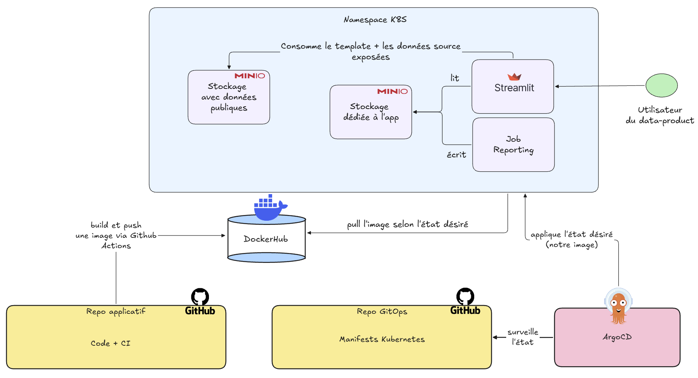

## Le voyage en une carte

Souvenez-vous de notre point de départ : un notebook qui générait un reporting `Excel`. Du code versionné, certes, mais hardcodé, manuel, difficile à faire évoluer sans tout casser. Un bon début, mais pas une fin en soi.

Regardez où nous en sommes maintenant. Une application accessible à n'importe qui via une simple URL, qui se redéploie automatiquement à chaque changement, sans qu'une seule commande ne soit lancée à la main sur le cluster. Entre les deux, vous avez traversé tout le cycle de vie d'un data product moderne :

- Un projet **structuré en packages** avec une responsabilité claire pour chacun
- Une **validation des données** qui monte la garde contre le schema drift
- Une **suite de tests** unitaires, d'intégration et end-to-end
- Une **intégration continue** qui refuse le code cassé ou mal formaté
- Une **interface utilisateur** qui transforme un fichier en produit
- Une **image Docker** propre, légère et sécurisée
- Un **déploiement GitOps** où Git fait foi de source de vérité

Chaque brique répondait à un besoin précis et s'emboîtait dans la suivante. C'est ça, une chaîne de production.

::: {style="text-align: center;"}

:::

## Ce que vous avez appris

Si vous ne deviez retenir qu'une chose de tout cet article, ce ne serait pas une commande `uv`, ni la syntaxe d'un manifest `Kubernetes`. Ces outils changeront, d'autres prendront leur place, c'est le propre de notre métier.

Ce qui restera, c'est le **pattern**. Le même fil rouge a guidé chacune de nos décisions, du module jusqu'au dépôt : **séparer les préoccupations**. Une fonction fait une chose. Un package a une responsabilité. Le code applicatif vit dans un dépôt, le déploiement dans un autre. À chaque échelle, la même intuition.

::: {.callout-note}
## Le SRP, encore et toujours

On a vu ce principe sous toutes ses formes : la responsabilité unique appliquée aux fonctions (`data.py` nettoie, `reporting.py` génère), aux packages (`financial_reporting` produit, `streamlit_app` expose), et même aux dépôts (applicatif contre GitOps). Ce n'est pas une coïncidence : c'est ce qui rend un système lisible, testable et maintenable dans le temps.
:::

Ce pattern n'est pas réservé au reporting réglementaire. Un dashboard interactif, une API, un pipeline ETL ou la mise en production d'un modèle prédictif reposent tous sur le même socle : du code versionné, un environnement reproductible et une chaîne de déploiement automatisée. Vous l'avez maintenant entre les mains.

## Nos raccourcis

Au fil de l'article, il y'a des vagues que je n'ai pas voulu prendre pour ne pas vous noyer.

::: {.callout-caution}
## Ce que nous n'avons pas fait (et qu'il faudrait faire en vrai)

- **L'authentification.** Notre application est ouverte : quiconque a l'URL y accède. Un reporting financier réel exigerait une couche d'authentification et de gestion des droits.
- **La gestion fine des erreurs.** Nos `try/except` sont volontairement simples. En production, on distinguerait les erreurs de permissions, de réseau et d'intégrité, avec des exceptions métier dédiées.
- **Le stockage persistant.** Notre `MinIO` tourne sur un `emptyDir` éphémère. Un usage réel passerait par un `PersistentVolumeClaim` ou un stockage distant distribué et partagé.
- **La gestion des secrets.** Notre secret est créé à la main, hors du dépôt GitOps. Ce n'est pas du pur GitOps : la version propre passerait par `Vault` ou un opérateur dédié.
- **L'orchestration du pipeline.** Notre `Job` tourne une fois. Un vrai reporting se régénère à intervalle régulier, via un `CronJob`, `Argo Workflows` ou un orchestrateur comme `Airflow`.
:::

## Et maintenant ?

Si vous voulez prolonger le voyage par vous-même, voici quelques pistes dans l'ordre de difficulté croissante :

1. **Découper l'application Streamlit.** Reprenez le monolithe et appliquez-lui le SRP : une fonction par section de l'interface, voire des modules séparés pour la mise en page et la logique de données.
2. **Enrichir le data product.** Ajoutez un filtre par période, une génération de reporting à la demande sur le périmètre filtré, une comparaison entre plusieurs périodes.
3. **Automatiser la mise à jour du tag.** Faites en sorte que la CI mette elle-même à jour le tag d'image dans le dépôt GitOps ou explorez `Argo CD Image Updater`.
4. **Planifier le pipeline.** Remplacez le `Job` ponctuel par un `CronJob` pour régénérer le reporting automatiquement.
5. **Mettez en place une chaîne ETL.** Les données sont statiques depuis le `MinIO`, vous pourriez simuler une chaine ETL `Postgresql` -> `MinIO`.

::: {.callout-tip}
## Une remarque rassurante

En tant que data scientist, engineer ou analyst, il est très peu probable que vous ayez un jour à construire une chaîne CI/CD de zéro comme nous venons de le faire. En entreprise, ces briques existent déjà : votre rôle sera de les comprendre et de les utiliser. Et c'est précisément pour ça que cet article existe. Vous saurez désormais lire un `Dockerfile`, comprendre ce qu'`ArgoCD` manipule pour vous et dialoguer avec vos équipes IT sans vous sentir perdus.
:::

## Merci

Merci d'avoir suivi cet article jusqu'au bout. J'espère qu'au delà des outils, vous repartez avec une intuition : celle de ce qui sépare un bout de code qui marche sur votre machine d'un produit que d'autres peuvent utiliser, faire évoluer et auditer.

Le fleuve continue bien au delà de ce que nous avons parcouru ensemble. Mais vous savez maintenant naviguer.

Bon vent. ⛵

::: {style="text-align: center;"}

:::